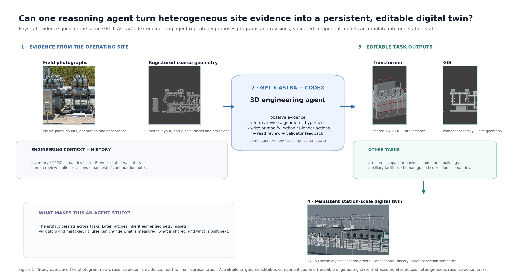
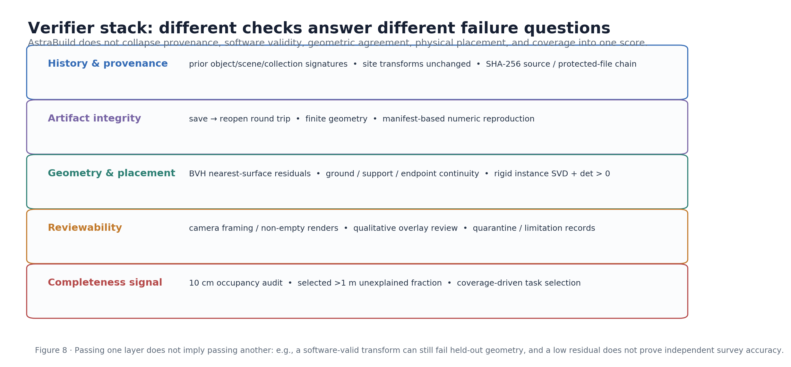
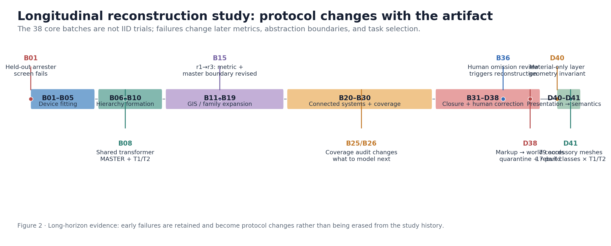
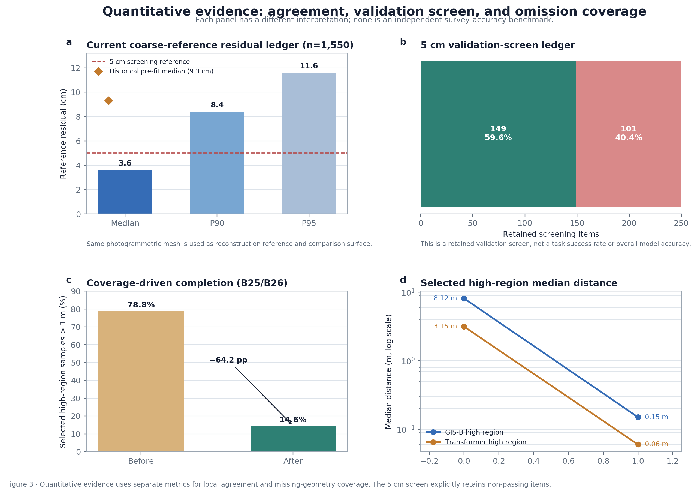
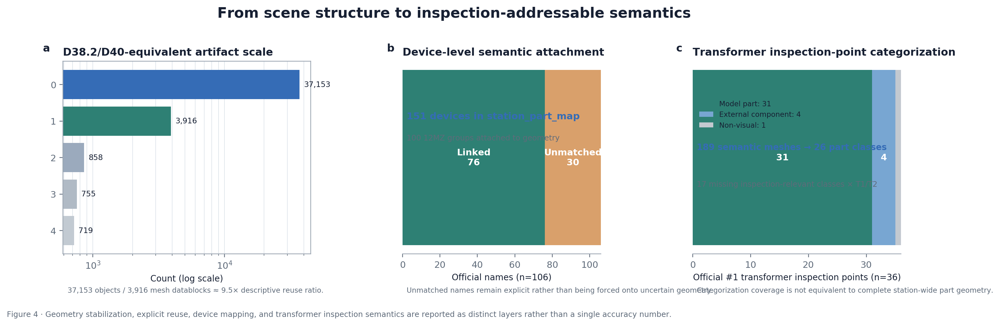
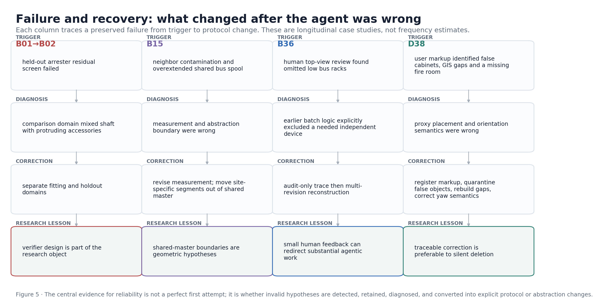
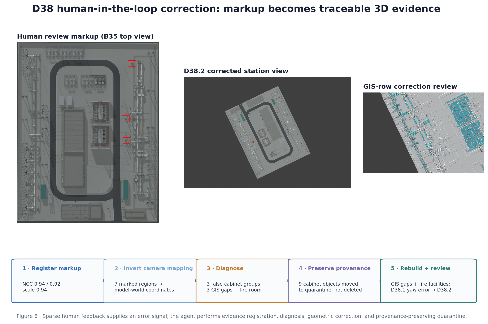
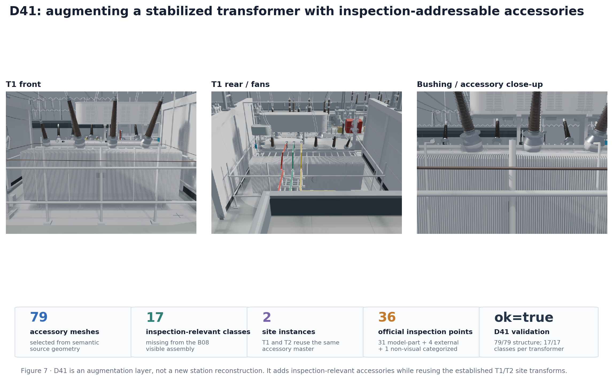

# AstraBuild: Evidence-Grounded Agentic Reconstruction of Component-Level Substation Digital Twins

**Draft status:** research-writing v0.2
**Authors:** *to be filled by the project team*
**Study site:** an anonymized operating substation
**Research endpoint:** D41
**Geometry baseline:** D38.2; D40 is a material-only, geometry-preserving presentation layer

> **Provenance note.** The project owner reports that the reconstruction was conducted with **Codex + GPT-6 Astra at Extra High reasoning effort**. The inspected historical Blender batch records do not embed model or reasoning-effort metadata. We therefore treat this configuration as **user-confirmed experimental metadata**, rather than a claim independently recoverable from the old batch logs. The research release freezes this fact explicitly in `release/experiment_manifest.json`.

---

## Abstract

Can a general-purpose reasoning agent turn a noisy photogrammetric reconstruction, heterogeneous image evidence, and engineering records into an editable, component-level digital twin over a long-horizon tool-use process? We study this question through a longitudinal reconstruction of a operating substation. Rather than treating 3D reconstruction as a one-shot surface-generation problem, **AstraBuild** formulates reconstruction as an evidence-grounded closed loop. At each iteration, an agent inspects selected coarse geometry, field photographs, semantic records, prior artifacts, and execution history; proposes structured Blender/Python operations; constructs or reuses editable assets; runs deterministic validation; and retains the result, failure, limitation, or human correction as context for subsequent iterations.

The engineering record contains **38 core reconstruction batches** through D38, followed by a geometry-preserving material layer (D40) and an inspection-semantic augmentation (D41). The D38.2/D40-equivalent scene contains **37,153 objects, 755 scenes, 858 collections, and 3,916 mesh datablocks**. The summarized geometry ledger contains **1,550 current reference-surface comparisons** with median/p90/p95 residuals of **0.036/0.084/0.116 m**. These values are comparisons against the same photogrammetric coarse mesh used by the reconstruction process and are **not independent survey accuracy**. A selected high-region coverage audit reduced the fraction of coarse samples farther than 1 m from reconstructed geometry from **78.8% to 14.6%**; the corresponding selected GIS-B and transformer median distances changed from **8.12→0.15 m** and **3.15→0.06 m**. The validation ledger explicitly retains **149 passing and 101 non-passing** 5 cm screening items rather than deleting or relabeling the latter.

Beyond final geometry, the longitudinal record exposes how the method changes after failure. B01 changes the holdout protocol after a failed arrester screen; B15 changes both measurement strategy and the boundary between reusable masters and site-specific geometry; B36 converts sparse human review into a targeted omission audit; and D38 maps human markup into model coordinates, quarantines false generated objects, rebuilds missing GIS/fire infrastructure, and corrects an orientation-semantics error in a subsequent revision. Finally, D41 aligns **79 accessory meshes spanning 17 inspection-relevant part classes** into a shared transformer accessory layer instantiated for T1 and T2. We argue that the primary contribution is not a claim of fully autonomous or survey-grade reconstruction, but an auditable pattern for using a general-purpose reasoning agent as a **long-horizon reconstruction operator** bounded by explicit evidence, deterministic tools, immutable history, and layered verification.

---

# 1. Introduction

Photogrammetry, neural radiance fields, and 3D Gaussian representations can capture scene appearance and geometry at impressive scale [@schonberger2016sfm; @mildenhall2020nerf; @kerbl2023gaussians]. Yet many industrial digital-twin tasks require a different output. Inspection planning, simulation, asset maintenance, semantic querying, and change management benefit from a scene that is not merely viewable, but **editable and structured**: repeated devices should share component families; connectors should remain explicit; device/part identities should be addressable; geometry sources and uncertainty should be traceable; and later corrections should not silently overwrite the history that produced them.

This distinction is pronounced in an operating substation. A coarse photogrammetric mesh provides global layout and occupied surfaces, but often contains holes, stretched geometry, fused neighboring equipment, and insufficient component detail. Field images reveal local appearance but may lack complete camera calibration, provide uneven coverage, and cannot by themselves authenticate every device identity. Engineering inventories provide names and inspection concepts but do not guarantee that a corresponding visible object has been reconstructed. The resulting problem is not simply “mesh refinement.” It is a long-horizon process of evidence selection, geometric hypothesis formation, reusable asset construction, installation, verification, omission discovery, human review, semantic attachment, and revision.

General-purpose language and vision-language models increasingly operate tools and reason over long contexts. Robotics provides a useful conceptual precedent: systems such as Code as Policies and VoxPoser use language models to construct executable programs or spatial objectives [@liang2023code; @huang2023voxposer], while GPT-Policy studies a fixed general-purpose VLM acting through a constrained robot tool interface and using execution feedback for replanning [@cheng2026gptpolicy]. The GPT-6 Astra embodied-policy report further emphasizes a System-2 role for semantic reasoning and exception handling, while a lower-level policy supplies action priors [@su2026astraembodied]. These works motivate an analogous question outside robot control:

> **Can a general-purpose reasoning agent operate an evidence-constrained 3D engineering workflow over hundreds of tool interactions, while deterministic validation and persistent artifacts bound what is accepted?**

AstraBuild explores this question through the reconstruction history of the VC-B anonymized substation. The key shift is to treat Blender not as a canvas manipulated directly by a model, but as an **actuated engineering environment**. The agent inspects evidence and generates programmatic actions; Blender/Python executes them; validators reopen and check the saved artifact; a batch record freezes what happened; and later batches reason over both the evolving scene and the external history.

The study is deliberately presented as a **longitudinal single-site case study**, not an IID benchmark. The protocol evolves in response to observed failures. Therefore, the strongest evidence is not a single “accuracy” number or a success rate. It is the combination of (1) artifact-scale structure and reuse, (2) geometry and coverage ledgers with explicit denominators, (3) preserved non-passing results, (4) failure-to-protocol transitions, (5) human-feedback traces, and (6) semantic augmentation that preserves earlier geometry history.

## 1.1 Research questions

We organize the study around five research questions.

**RQ1 — Structured reconstruction.** Can coarse geometry, images, and engineering records be transformed into an editable component-level scene with reusable equipment families, rather than an undifferentiated surface?

**RQ2 — Verifier-bounded reliability.** Can deterministic validation expose invalid hypotheses and force explicit revisions of geometry, measurement strategy, or abstraction boundaries rather than silently accepting plausible-looking results?

**RQ3 — Coverage-driven completion.** Can coverage/residual audits identify important missing geometry that inventory-driven completion misses?

**RQ4 — Human-steerable correction.** Can sparse human spatial feedback be converted into traceable 3D corrections without requiring the user to manually edit vertices or rebuild the asset?

**RQ5 — Inspection semantics.** Can stabilized geometry be augmented with inspection-addressable parts and semantic mappings while preserving prior geometry history?

## 1.2 Contributions

The current release makes four contributions.

1. **A reconstruction-agent architecture.** We formalize a closed loop that separates evidence selection, model reasoning, deterministic Blender/Python actions, layered validation, and immutable external memory.
2. **A longitudinal engineering record.** The release summarizes 38 core reconstruction batches and subsequent D40/D41 layers, including failed drafts and user-driven corrections rather than only final success cases.
3. **A multi-metric evaluation protocol.** We distinguish internal reference residual, validation-screen status, missing-geometry coverage, scene reuse, and semantic coverage instead of collapsing them into one score.
4. **Failure and semantic case studies.** We analyze B01→B02, B15, B36, D38, and the later semantic audit/D41 augmentation to show how a reasoning-driven workflow can revise not only parameters but also its own measurement and abstraction choices.

---

# 2. Related Work

## 2.1 Surface reconstruction and editable digital twins

Classical structure-from-motion and photogrammetry recover camera/scene geometry from image collections [@schonberger2016sfm]. NeRF and 3D Gaussian Splatting provide powerful novel-view and appearance representations [@mildenhall2020nerf; @kerbl2023gaussians]. These approaches address important perception problems but do not automatically produce the component hierarchy required by engineering applications. A fused surface does not say which repeated geometry should share a master asset, whether a tube belongs to one GIS bay or a cross-bay bus, how a transformer inspection point maps to a semantic part, or how a later correction should preserve history.

AstraBuild therefore uses photogrammetric geometry as **evidence and spatial context**, not as the final representation. The output is a Blender scene with editable components, collection instances, explicit connectors, review scenes, and semantic mappings.

## 2.2 General-purpose models as tool-using agents

Code as Policies demonstrates that language models can synthesize executable programs over perception/control APIs [@liang2023code]. VoxPoser constructs composable 3D value maps from language for robot manipulation [@huang2023voxposer]. RT-2 and related VLA work study models that connect web-scale semantics to physical actions [@brohan2023rt2]. These systems motivate the use of programmatic and spatial interfaces rather than raw text responses.

AstraBuild similarly exposes a structured action space: extract local reference geometry, build a component master, instantiate it into a site frame, generate connectors, render review views, compute comparisons, quarantine an invalid object, or freeze a batch. However, the “episode” lasts across many files and revisions rather than seconds of robot control.

## 2.3 Closed-loop reasoning and constrained execution

GPT-Policy is especially relevant in its separation of (i) context construction, (ii) a fixed VLM selecting tool requests, and (iii) an execution layer that validates/actions and returns observations and outcomes for the next decision [@cheng2026gptpolicy]. The GPT-6 Astra embodied-policy report likewise distinguishes high-level semantic reasoning from lower-level trajectory priors and evaluates both overall metrics and qualitative behavior [@su2026astraembodied]. RoboDojo provides an example of disciplined task-level evaluation with explicit metrics and breakdowns [@chen2026robodojo].

AstraBuild borrows the **reporting discipline**—explicit questions, diagrams, denominators, per-mechanism failure analysis, and scope statements—but does not claim a matched robot-policy benchmark. Its historical data contain one long reconstruction process, not controlled multi-model episodes.

## 2.4 Difference from one-shot “LLM makes a Blender scene” demonstrations

Community demonstrations of general models generating Blender scenes are useful evidence that tool use is feasible. Our focus is narrower and more engineering-oriented: whether the generated scene is **auditable across long time horizons**. This requires immutable outputs, source hashes, saved-file reopening, independent validators, explicit non-passing records, reusable asset boundaries, and human-feedback traces. The study therefore treats successful rendering as necessary but insufficient evidence.

---

# 3. Problem Formulation

Let the persistent reconstruction state after batch \(t\) be

\[
S_t = (M_t, A_t, X_t, Q_t),
\]

where \(M_t\) denotes the current Blender scene geometry, \(A_t\) the reusable asset hierarchy, \(X_t\) semantic/inspection mappings, and \(Q_t\) provenance and validation records.

The agent does not receive the entire repository at every decision. An evidence compiler selects a bounded context

\[
C_t = \mathcal{C}(G, I, R, U, H_t),
\]

from a registered coarse mesh \(G\), field images \(I\), engineering records \(R\), UE/manual spatial priors \(U\), and persistent history \(H_t\).

The reasoning model proposes a structured action or program

\[
a_t \sim \pi_\theta(\cdot\mid C_t, S_t, f_{t-1}),
\]

where \(f_{t-1}\) is prior execution/validation feedback. Actions include reference extraction, geometry construction, master/instance creation, transform fitting, connector generation, rendering, validation, quarantine, and release freezing.

A deterministic execution harness \(E\) materializes the action:

\[
(\tilde S_{t+1}, e_t) = E(a_t,S_t),
\]

and a verifier \(V\) produces structured checks

\[
v_t = V(\tilde S_{t+1}, G, Q_{\le t}).
\]

The next artifact is accepted only if the relevant batch-specific checks are satisfied. Otherwise the failure, diagnostic, or limitation is retained and used for replanning. Importantly, \(V\) is not a single scalar oracle. It contains multiple checks with different semantics: file/provenance integrity, history preservation, geometric agreement, physical placement, reviewability, and coverage.

**Figure 1.** High-level reasoning proposes reconstruction operations, but deterministic execution and layered validation determine which artifacts survive into persistent history.

---

# 4. Study Materials and Provenance

## 4.1 Study site and base geometry

The study reconstructs an operating operating substation. The global spatial reference is a registered photogrammetric mesh composed of 23 tiles covering approximately 112 m × 134 m. This mesh is valuable for global layout, occupied-region discovery, local reference extraction, and visual comparison. It also contains noise, holes, fused geometry, and missing details. Consequently, it is not treated as an independent survey-grade ground truth.

## 4.2 Image evidence

The project uses UAV and ground photography. An early installation queue records 775 candidate identity photographs; later audit directories add denser equipment-specific evidence. Images are used for visible component shape, count, ordering, material, and qualitative alignment. They are not treated as definitive nameplate identity when the physical instance cannot be authenticated.

Earlier workbench analysis also documents incomplete camera calibration in portions of the data. Accordingly, this study does not present an across-the-board image reprojection accuracy benchmark.

## 4.3 Engineering and semantic records

The repository contains equipment inventories and 12MZ semantic/code information. The technical report summarizes 153 registered devices, 106 official names, and 1,842 12MZ rows. These records guide expected equipment and inspection concepts, but a list entry does not prove that a corresponding visible structure has been reconstructed.

The semantic layer later combines 12MZ codes, official names, existing site geometry, and UE4/manual boxes. A station-level part map covers 151 devices; among 106 official names, 76 are attached and 30 remain unmatched rather than being forced onto uncertain geometry.

## 4.4 UE/manual spatial priors

The project includes 82 manually positioned UE boxes. They provide useful cross-checks and position priors but are not independent metric ground truth. Coordinate-system semantics are a recurring source of error, as illustrated by the D38 orientation correction.

## 4.5 Human review and historical memory

Human intervention is a material part of the method. Examples include authorization that two transformers can share a component assembly, top-view review that identifies omitted bus racks, and marked screenshots that indicate false objects/missing GIS/fire infrastructure. This evidence enters the same persistent history as automated validation results.

## 4.6 Agent configuration provenance

The owner-confirmed configuration is Codex + GPT-6 Astra with Extra High reasoning. The historical Blender batch records inspected for this release do not contain a frozen model identifier/reasoning-effort field. We therefore do **not** use the repository to independently prove that configuration. The release manifest records the owner-confirmed setting and explicitly labels its provenance.

---

# 5. AstraBuild Method

## 5.1 Evidence compiler

The raw data are too heterogeneous to expose wholesale. Each batch constructs a bounded evidence package. Typical elements include:

- selected/marked field images;
- local coarse-mesh crops stored as reference arrays;
- source triangle/object origins that preserve traceability;
- coordinate transforms and local frames;
- a targeted slice of the installation queue or semantic inventory;
- previous batch manifests and validation summaries;
- rendered clean/overlay/reference views;
- explicit user feedback and unresolved limitations.

This plays a role analogous to context construction in general-purpose VLM agents: the goal is not maximum context volume but preservation of the evidence relevant to the current decision.

## 5.2 Asset–installation separation

A central early design is the distinction between **photo-derived asset shape** and **site installation**. The P-line experiments build normalized asset hypotheses from images, while the B-line uses site-local coarse geometry and coordinate frames to install/reconstruct equipment in meters. Two attempted “meeting” tests reject asset installation when proportion/correspondence diagnostics do not support it. This prevents candidate assets from automatically becoming site truth.

## 5.3 Reusable masters and site instances

Repeated equipment is represented with reusable component families. The mature pattern separates:

1. a local editable **MASTER** collection;
2. optional nested reusable submodules;
3. rigid **SITE** instances positioned by site transforms;
4. site-specific connectors, conductors, or finite segments that should not be baked into a globally shared master.

B08 is a major transition: after explicit authorization that the two main transformers share components, the workflow creates a common transformer assembly and independent T1/T2 site instances. Later batches reuse assets across bays and voltage levels while separating variants when field evidence contradicts equivalence.

## 5.4 Programmatic reconstruction actions

Instead of streaming raw mesh vertices from model output, the agent primarily writes or revises Python programs that operate Blender. Common actions include:

- create primitives/parametric component geometry;
- place and orient component instances;
- generate repeated arrays, insulator discs, bus tubes and wires;
- fit transforms to local reference geometry;
- preserve/reuse mesh datablocks;
- split shared master geometry from site-specific connectors;
- generate cameras and review scenes;
- compute local comparisons;
- isolate questionable geometry;
- save immutable output files and manifests.

This action space is intentionally closer to “program synthesis over an engineering API” than to text-to-mesh generation.

## 5.5 Immutable batch protocol

The mature batches follow a repeated artifact pattern:

- continuation/readme: task scope, evidence and unresolved items;
- plan JSON: structured intended changes;
- builder: deterministic Blender/Python construction;
- validator: separate post-save checks;
- output blend/component library;
- manifest and validation JSON;
- clean/overlay/reference renders or review HTML.

Outputs are treated as immutable releases; a failed or revised attempt receives a new revision path rather than silently overwriting the previous file.

## 5.6 Validation stack

AstraBuild separates checks by the question they answer.

**Figure 2.** Passing one validation layer does not imply the others. For example, a finite, reloadable Blender file can still be geometrically wrong, and a low residual against the coarse mesh does not imply independent survey accuracy.

The technical report groups the validation mechanisms into the following families:

| Family | Typical checks | What it establishes | What it does not establish |
|---|---|---|---|
| History/provenance | prior object signatures, transforms, protected file hashes | no unintended rewrite of earlier work | geometric correctness |
| Artifact integrity | save→reopen, finite coordinates, manifest replay | the file is reproducible/readable | correct physical interpretation |
| Geometry | BVH nearest-surface residuals, held-out domains | agreement with selected reference surfaces | independent survey truth |
| Placement | ground/support contact, endpoint continuity, rigid SVD | local geometric/kinematic consistency | correct equipment identity |
| Reviewability | camera framing, non-empty renders, overlays | reviewers can inspect the change | quantitative accuracy |
| Coverage | occupied-sample distance, unexplained-region fractions | likely omissions in selected regions | complete semantic identity |

## 5.7 Persistent history as external memory

The agent’s practical long-term memory is the filesystem: continuation notes, plans, source hashes, batch manifests, validation JSON, failure tracebacks, review media, and explicit limitations. This history is not merely archival. It changes later decisions: B01 changes B02’s validation protocol; B15 changes the master/site abstraction; B36 uses historical code to explain an omission; D38 retains incorrect proxies in quarantine rather than erasing their provenance.

---

# 6. Experimental Design and Metrics

## 6.1 Why this is not an IID benchmark

The 38 core reconstruction batches operate on a single evolving artifact. Later batches inherit the geometry and methodology created earlier. Furthermore, failures can change the protocol. Consequently:

- batches are not independent trials;
- the task distribution is adaptive;
- validation domains can be revised after diagnosis;
- not every metric is comparable across all batches;
- the evidence supports a longitudinal systems analysis, not a causal ranking of models.

**Figure 3.** The study progresses from local equipment fitting to reusable hierarchy, connected systems, coverage-driven completion, human review, and semantic augmentation. Highlighted events are protocol-changing failures or transitions.

## 6.2 Research artifact scale

The report summarizes:

- 38 core reconstruction batches through D38;
- 54 builder scripts and 58 validator scripts;
- 150 manifests;
- 71 validation JSON files;
- 28 installation-queue revisions;
- 109 local coarse-reference NPZ crops;
- 719 new review scenes;
- 2,859+ protected-file hashes by the later B35-era chain.

These counts describe the engineering record, not statistically independent samples.

## 6.3 Internal reference-surface residual

Many batches compare sampled/selected reconstructed geometry to local surfaces of the registered photogrammetric coarse mesh. Let \(x_i\) denote a retained sample associated with a batch-specific comparison domain and \(G\) the local reference surface. A generic nearest-surface quantity is

\[
d_i = \operatorname{dist}(x_i,G).
\]

The global summary aggregates retained current records from heterogeneous batch checks and reports median, p90 and p95. Because the same coarse mesh participates in the reconstruction process, these values represent **internal reference agreement** rather than independent survey accuracy.

## 6.4 Five-centimeter validation screen

The historical ledger additionally summarizes a 5 cm screening convention. We report counts below/above the selected criterion:

\[
N_{\mathrm{pass}}=149,\qquad N_{\mathrm{not\ pass}}=101.
\]

This is not a task success rate. The value of this ledger is that non-passing items remain explicit and can be carried forward as unresolved evidence.

## 6.5 Coverage-gap fraction

For a selected high-region occupancy audit, define a threshold \(	au=1\) m and a set of coarse/reference samples \(\mathcal{P}\). The unexplained fraction is

\[
C_\tau = \frac{1}{|\mathcal{P}|}\sum_{p\in\mathcal{P}} \mathbf{1}[\operatorname{dist}(p,M_t)>\tau].
\]

This is an omission/completeness signal. It answers “how much of this selected coarse region is still far from the component model?” rather than “what is the model’s absolute accuracy?”

## 6.6 Reuse ratio

As a descriptive scene-structure indicator we report

\[
R_{\mathrm{reuse}} = \frac{N_{\mathrm{scene\ objects}}}{N_{\mathrm{mesh\ datablocks}}}
= \frac{37153}{3916}\approx 9.5.
\]

The ratio indicates extensive instancing/shared data; it should not be interpreted as labor speedup or file compression.

## 6.7 Semantic accounting

We separate device mapping from part/inspection mapping. At station level, 151 devices are represented in the part map; 76 of 106 official names are attached and 30 remain unmatched. In the #1 transformer pilot, 189 semantic meshes are mapped into 26 part classes. The 36 official inspection concepts are categorized as 31 model-part points, 4 external-component points, and one non-visual “operating sound” concept. D41 then adds selected missing visible accessories to the actual site scene.

## 6.8 Controls and missing baselines

The history does not contain controlled reruns with other foundation models, lower reasoning efforts, or a professional CAD baseline under identical evidence/time budgets. We therefore do not present a model leaderboard.

The history does contain useful internal controls:

- **rejected asset-installation hypotheses** before site reuse is accepted;
- **D40 geometry invariance**, where material assignment changes appearance while object/scene/collection/mesh counts, transforms and vertex counts are verified unchanged;
- **before→after coverage audits** within selected regions;
- **failed revisions** that document why a later abstraction changed.

These are reported as systems evidence, not causal ablations.

---

# 7. Results

## 7.1 RQ1 — Structured reconstruction and reuse

At the D38.2/D40-equivalent geometry layer, the project contains **37,153 objects, 755 scenes, 858 collections, 3,916 mesh datablocks, and 29,986,649 vertices**. The object/mesh-datablock ratio is approximately 9.5×. Between B14 and B36, the technical report counts 9,022 newly created root objects, while many expanded scene objects reuse nested/shared component meshes.

The artifact includes, among other reconstructed structures, 48 arrester bodies, multiple two anonymized voltage classes GIS bays, two shared-assembly transformers, six capacitor groups, approximately 88.8 m of busbar, 804 suspension discs, approximately 10,182 m² of ground surface, and a main building with 946 components.

The important qualitative result is not only size. The asset hierarchy evolves. Early batches test frozen asset installation; B08 introduces a mature shared transformer assembly; later batches reuse masters across bays while separating variants and site-specific connectors when evidence requires it. This supports the claim that the agentic process can build an editable component hierarchy rather than only a large monolithic mesh.

## 7.2 RQ2 — Internal geometric agreement with retained failures

The current summarized residual ledger contains \(n=1{,}550\) records with

- median = **0.036 m**;
- p90 = **0.084 m**;
- p95 = **0.116 m**.

A historical pre-fit comparison ledger (\(n=450\)) has median 0.093 m and includes very large outliers from geometry that was not yet modeled/aligned. Because the domains are heterogeneous and the protocol evolves, this historical summary should not be read as a single clean before/after distribution.

The 5 cm screening ledger contains 149 passing and 101 non-passing items. This matters methodologically: the final report does not obtain “good accuracy” by dropping non-passing records.

**Figure 4.** Four metric views: current reference residuals, retained screening items, selected coverage-gap reduction, and selected high-region before/after distances. Each panel answers a different question.

## 7.3 RQ3 — Coverage-driven reconstruction exposes missing geometry

B25/B26 represent a key transition from inventory-driven modeling (“what named device remains?”) to coverage-driven modeling (“what high-region coarse structure is still unexplained?”). In the selected audit, the fraction of high-region coarse samples more than 1 m from component geometry changes from **78.8% to 14.6%**. The selected GIS-B high-region median changes from **8.12 m to 0.15 m**, while the transformer high-region median changes from **3.15 m to 0.06 m**.

This evidence demonstrates that a semantic inventory can be insufficient for completion. A project can appear “complete” by name while still leave substantial occupied geometry unexplained. Coverage auditing therefore becomes an active task-selection mechanism for later reconstruction.

## 7.4 RQ1/RQ5 — Structure and semantic attachment are different layers

**Figure 5.** Scene scale/reuse, official-name attachment, and transformer inspection-point accounting are reported separately. The figure avoids turning these different notions of “coverage” into one number.

At station level, 151 devices appear in the current part map. The report records 100 12MZ semantic groups attached to geometry and 76/106 official names attached. Thirty official names remain unmatched, including system-level items and absent/reserve families. This explicit remainder is scientifically useful: semantic completeness is not manufactured by forcing every name to the nearest object.

---

# 8. Failure and Recovery Studies

The strongest evidence that the verifier matters comes from failures that alter later behavior. We focus on four geometry/workflow cases and one semantic case.

**Figure 6.** Preserved failures trace from trigger to diagnosis, correction, and later methodological lesson. These case studies illustrate mechanisms; they do not estimate prevalence.

## 8.1 B01→B02: a failed metric changes the evaluation protocol

B01 attempts to install three 749-area arresters. Software-level checks—source-asset hash preservation and transform consistency—pass, but held-out cylindrical-domain RMS values are approximately 0.048/0.073/0.051 m, causing the batch to fail the selected 5 cm screen.

The response is not to tune a number until it passes. The failure is preserved. Analysis indicates that the comparison domain mixes the intended shaft with accessory protrusions. B02 therefore separates fitting and holdout regions. Crucially, the later protocol explicitly states that the new number is not directly comparable to B01 as if it were the same metric.

**Lesson.** In an agentic engineering workflow, the evaluation code is itself a hypothesis about which evidence should count. Validator design must therefore be inspectable and revisable.

## 8.2 B15: measurement failure reveals an abstraction failure

B15 reconstructs multiple reserve GIS structures and goes through several revisions. A normal-voting measurement is contaminated by neighboring equipment. Separately, a shared bus-spool abstraction extends similar geometry across sites where the finite site-specific extent differs, creating overlap/conflict.

The response changes two levels:

1. the measurement strategy is replaced;
2. site-specific finite segments are removed from the shared master and represented locally.

**Lesson.** A component master is not merely a software reuse trick. It encodes a geometric/equipment equivalence hypothesis that can be falsified by site evidence.

## 8.3 B36: sparse review exposes an omission in earlier task logic

After B35, a human top-view comparison identifies missing low bus racks between transformers and the building. The workflow first runs an audit-only investigation and traces the omission to earlier batch logic that had explicitly treated the structure as outside the transformer assembly.

The new reconstruction itself requires multiple revisions, including a draft with a non-finite path section and a later 0.16 m routing change to avoid existing fire-pipe geometry. Failed drafts remain identifiable.

**Lesson.** Human feedback need not be vertex-level modeling. A small spatial error signal can trigger a substantial evidence search, code audit, reconstruction, and verification sequence.

## 8.4 D38: markup becomes a coordinate-grounded correction loop

D38 begins from user-marked clean/overlay top views indicating three false red boxes, missing GIS sections, and fire infrastructure. The evidence file registers marked images to the original review views with normalized correlation coefficients 0.94/0.92 (scale 0.94), then inverts the review-camera mapping to estimate model-world coordinates for the marked regions.

The workflow identifies three false generated cabinet groups. Rather than deleting them, nine component objects are moved into a quarantine collection that is not linked into the station review scene. Three GIS gaps and the fire room/sand boxes are reconstructed. A first GIS-orientation interpretation in D38.1 conflates a registration transform with equipment row orientation; the subsequent D38.2 review corrects the orientation semantics.

**Figure 7.** Human markup is converted into a traceable chain: image registration → model coordinates → object/region diagnosis → quarantine/rebuild → review. The key property is that the original error remains auditable.

**Lesson.** Coordinate-system semantics—not only numerical optimization—are a major risk in long-horizon spatial agents. Provenance-preserving correction is preferable to silent cleanup.

## 8.5 Semantic v3: naming/box heuristics also fail

After geometry reconstruction, the part-annotation pipeline initially uses naming, boxes and source semantic groups to attach device/part identities. Isolated renders and field photographs expose several mistakes: cross-bay bus tubes assigned to a GIS bay, duplicate device naming, arrester parts assigned to switches, and incomplete/misleading grounding-switch and capacitor interpretations.

The v3 semantic pass restructures device-family rules and explicitly marks missing geometry where appropriate. For example, some inventory arresters/switches remain semantic records without site geometry rather than being “explained” by a nearby unrelated asset.

**Lesson.** Semantic attachment needs the same verify-and-revise discipline as geometry. A plausible string/nearest-box match is not sufficient evidence.

---

# 9. RQ4 — Human-Steerable Reconstruction

Human input in AstraBuild is episodic and high-level. It appears in three distinct forms:

1. **equivalence/constraint authorization** — e.g., permission to treat two transformer component assemblies as equivalent;
2. **visual omission/error feedback** — e.g., B36 top-view omission and D38 marked regions;
3. **semantic review** — evidence that a device/part mapping is wrong even when a string/box heuristic appears plausible.

The agent performs the expensive follow-up: search history, locate source geometry, derive coordinates, generate/revise code, render comparisons, and run validators. We therefore describe the system as **agent-driven and human-steerable**, not fully autonomous.

A future controlled evaluation should measure how much human effort is required under different feedback interfaces (free text, image markup, semantic approval, or no intervention). The current historical record does not contain a clean time-on-task baseline for this comparison.

---

# 10. RQ5 — Inspection Semantics and D41

## 10.1 Geometry first, semantics later

The project intentionally separates geometry stabilization from semantic attachment. This reduces the risk of maintaining parallel, inconsistent “geometry truth” and “inventory truth” while the shape is still rapidly changing.

The #1 transformer semantic pilot maps 189 source semantic meshes into 26 part classes with zero unclassified meshes under the pilot rule set. The 36 official inspection concepts are categorized into:

- 31 model-part points;
- 4 external components;
- 1 non-visual “operating sound” concept.

This accounting clarifies that an inspection requirement can exist even if it is not a directly renderable mesh.

## 10.2 D40 as a structural invariance control

D40 changes material assignment for steel, conductors, aluminum bus pipe, fittings and porcelain-like components. Its validator checks that the D38 input hash remains unchanged and that object/scene/collection/mesh counts, transforms and total vertices match the geometry baseline. A first material pass (D40.1) misses geometry reachable only through instance collections; D40.2 revises the assignment traversal without changing geometry.

D40 is useful scientifically because it demonstrates a controlled separation between **presentation state** and **geometry state**.

## 10.3 D41 transformer accessory augmentation

D41 addresses a different gap: the shared B08 transformer assembly lacks several inspection-relevant accessories that exist in the 12MZ semantic group. The workflow selects 79 accessory meshes covering 17 part classes and aligns them to the B08 transformer frame with an anisotropic affine mapping anchored on the transformer tank:

\[
x' = 1.3235x,\qquad y' = 1.3167y,\qquad
z' = 0.16 + 1.1567(z-0.45).
\]

The transformed accessory geometry is stored in a new shared collection and instantiated into T1 and T2 using the same site transforms as the existing B08 assemblies. D41 validation records `ok=true`, checks 79/79 structure, and verifies 17/17 selected part classes for each transformer.

**Figure 8.** D41 adds an inspection-semantic accessory layer to the stabilized transformer representation. It should be interpreted as an augmentation, not a new station reconstruction.

---

# 11. Discussion

## 11.1 The model’s role is closer to a reconstruction operator than a generator

The most useful behavior in this study is not one-shot mesh generation. It is the ability to move among representations: inspect a rendered overlay; read a validation JSON; search earlier code; infer that a master abstraction is too broad; write a new builder; construct a local coordinate frame; re-render; and preserve the result as another immutable layer.

This is analogous to the distinction in embodied-agent research between semantic deliberation and low-level constrained execution. The general model handles task decomposition, evidence interpretation, and exception recovery; deterministic geometry code and validators provide the lower-level “physics” of the reconstruction environment.

## 11.2 Verification should be heterogeneous

A single scalar reward would obscure important failure types. AstraBuild explicitly separates:

- **software/artifact validity** — can the file be reopened, is geometry finite, are protected inputs unchanged?
- **historical validity** — did the new batch preserve prior objects and transforms?
- **local geometric agreement** — does selected geometry match a reference domain?
- **installation validity** — do components touch/support/connect as intended?
- **coverage** — what occupied coarse structure remains far from modeled geometry?
- **semantic validity** — is the device/part identity supported by evidence?
- **reviewability** — can humans inspect clean/overlay/reference views?

The failure cases show why these layers cannot substitute for one another. B01 is software-valid but fails a geometric screen; D38.1 can be numerically transformed yet semantically oriented incorrectly; semantic mapping can be geometrically nearby but identity-wrong.

## 11.3 Reusable components are hypotheses

The MASTER/SITE hierarchy is one of the strongest practical outcomes of the work, but reuse should not be interpreted as automatic equivalence. B15 demonstrates that site-specific geometry can be incorrectly absorbed into a master. Later reuse is therefore evidence-conditioned: shared geometry is valuable precisely because a change propagates consistently, but only when the equivalence assumption is justified.

## 11.4 Coverage can be more useful than inventory near the end

Early work naturally follows the equipment list. Later, the main risk is “unknown unknowns”: structures absent from the task list or accidentally considered complete. Coverage auditing uses the coarse scene as an occupancy cue to ask where large unexplained regions remain. This turns the reference mesh from a fitting target into a **task-selection sensor**.

## 11.5 Human feedback is an interface, not a contradiction

A fully autonomous narrative would be inaccurate. The better interpretation is that sparse human feedback provides a compact error signal while the agent handles the expensive reconstruction response. Image markup is particularly powerful because it preserves spatial information without requiring the reviewer to know Blender coordinate frames.

## 11.6 Relation to robotics technical-report style

The study deliberately adopts several reporting practices visible in GPT-Policy and the GPT-6 Astra embodied-policy report: explicit research questions, architecture diagrams, metric denominators, qualitative episodes, failure analysis, and limitations. The analogy should not be overstated. A robot policy is evaluated across repeated task episodes, while AstraBuild records one long evolving engineering artifact. Therefore we use the reporting structure, but not the benchmark statistics, of those references.

---

# 12. Limitations and Threats to Validity

## 12.1 Single-site external validity

The reconstruction covers one substation. Device-family reuse within the site does not demonstrate transfer to different stations, climates, equipment vendors, or image-collection protocols. A multi-site benchmark is required before making generalization claims.

## 12.2 No independent metric ground truth

The coarse photogrammetric mesh is both evidence used by the reconstruction workflow and the comparison surface for many residual checks. Therefore a median residual of 3.6 cm is **not independent survey accuracy**. Independent total-station/LiDAR/control-point measurements would be needed for such a claim.

## 12.3 Evolving validation protocol

The protocol changes after failures. This is desirable for engineering but complicates statistical comparison. B01 and B02, for example, use different comparison-domain logic. The report therefore avoids interpreting all batch values as samples from one stationary distribution.

## 12.4 Missing controlled model baselines

The historical logs do not contain matched reruns using other foundation models, lower reasoning effort, no-image/no-coarse ablations, or a professional human CAD baseline under a fixed budget. As a result, the evidence cannot isolate how much performance is attributable specifically to GPT-6 Astra versus Codex tooling, the validators, human feedback, or the evidence quality.

## 12.5 Model provenance is owner-confirmed

The old batch records do not embed a frozen model/reasoning-effort identifier. The release manifest remedies this prospectively but cannot retroactively prove the historical configuration.

## 12.6 Human intervention

Human authorization/review materially affects B08, B36, D38 and semantic audit decisions. The release therefore does not claim fully autonomous reconstruction. Future work should report human-intervention count/time as a first-class metric.

## 12.7 Identity and hidden geometry

Photographs do not provide perfect identity evidence and cannot reveal all occluded structure. Several official names remain unmatched; some device families are explicitly recorded as semantic entries without site geometry. Hidden/occluded components may still contain modeling assumptions.

## 12.8 Cost and latency are not yet reconstructed

The current artifact history is rich in geometry and validation records but does not provide a clean per-batch model-token/cost/latency ledger comparable to the robotics reports. Future experiments should freeze request-level model usage, wall-clock time, Blender execution time, human review time, and failure/retry cost.

---

# 13. Conclusion

AstraBuild studies general-purpose reasoning as a component of a long-horizon 3D engineering process. The reconstructed substation is evidence that a model can do more than emit isolated scripts: it can participate in a persistent loop of evidence selection, programmatic modeling, asset reuse, validation, failure diagnosis, human-steered correction, coverage-driven task selection, and semantic augmentation.

The strongest result is not a claim that the final scene is survey-grade or fully autonomous. Instead, the study shows how to make an agentic reconstruction process **auditable**. Failures remain visible. Validation is heterogeneous. Reuse assumptions can be revised. Human feedback has a traceable path into geometry. Presentation layers can be checked for geometric invariance. Semantic mappings can be audited separately from shape. These properties are prerequisites for using general-purpose reasoning models in industrial digital-twin workflows where plausible appearance alone is insufficient.

---

# Appendix A. Version Boundary

| Layer | Role | Geometry semantics |
|---|---|---|
| D38.2 | core station geometry after human-markup correction | principal geometry baseline for headline artifact counts |
| D40 | material/presentation layer | validated to preserve geometry, transforms and vertex counts |
| D41 | transformer inspection accessory augmentation | additive semantic/geometry layer; research endpoint |

The paper never treats all numbers as if measured on one identical artifact. Every metric should retain its stated scope.

---

# Appendix B. Validation Taxonomy

The historical report describes at least eleven recurring check types:

1. historical object/scene/collection preservation;
2. site transform preservation;
3. protected-file SHA-256 chain;
4. exported asset round trip;
5. finite-coordinate checks;
6. manifest/numeric reproduction;
7. BVH/reference-surface comparison;
8. contact, grounding, support, and endpoint continuity;
9. camera framing/non-empty render checks;
10. rigid instance / uniform-scale SVD checks;
11. occupancy/coverage audits.

A future standardized release should encode these as a versioned schema rather than allowing each batch validator to use partially different JSON structures.

---

# Appendix C. Longitudinal Phase Summary

| Phase | Batches | Main transition | Representative evidence |
|---|---|---|---|
| Initial device fitting | B01–B05 | test frozen photo assets and site fitting | B01 failure retained; B02 changes holdout domain |
| Hierarchy formation | B06–B10 | civil + transformer + capacitor families | B08 shared transformer assembly; local meter frames |
| GIS/family expansion | B11–B19 | larger reusable equipment families | cross-batch reuse; variants separated where needed |
| Connected systems + coverage | B20–B30 | busbars, conductors, insulator strings, occupancy audits | endpoint continuity; B25/B26 coverage-driven task selection |
| Closure + human correction | B31–D38 | civil closure, small facilities, omission/correction loop | B36 human omission; D38 markup registration and quarantine |
| Presentation → inspection semantics | D40–D41 | material invariance + transformer semantic augmentation | D40 geometry invariant; D41 79 meshes / 17 classes × T1/T2 |

---

# Appendix D. Claim Guardrails

The research release uses the following language rules.

- **Allowed:** “median residual to the same photogrammetric reference mesh is 3.6 cm.”
  **Not allowed:** “the reconstructed station has 3.6 cm absolute accuracy.”
- **Allowed:** “149/250 retained 5 cm screening items pass.”
  **Not allowed:** “the model has 59.6% accuracy.”
- **Allowed:** “the selected high-region >1 m gap fraction changes 78.8%→14.6%.”
  **Not allowed:** “whole-station completeness is 85.4%.”
- **Allowed:** “37,153 objects / 3,916 mesh datablocks gives a descriptive ≈9.5× reuse ratio.”
  **Not allowed:** “modeling is 9.5× faster.”
- **Allowed:** “the workflow is agent-driven and human-steerable.”
  **Not allowed:** “the entire station was reconstructed fully autonomously.”

---

# Appendix E. Reproducibility Checklist

The isolated publication layer contains:

- `release/experiment_manifest.json` — version boundary and model-provenance status;
- `release/metrics.json` — headline measurements with source/scope;
- `release/study_protocol.json` — research questions, evidence roles and metric interpretations;
- `release/claim_matrix.md` — claim-to-evidence guardrails;
- `figures/` — SVG/PDF/PNG publication figures;
- `scripts/generate_figures.py` — deterministic figure generator;
- `scripts/validate_release.py` — offline publication-structure/path/claim checks;
- `website/` — bilingual static report;
- `paper/` — Markdown and LaTeX manuscript sources.

Historical reconstruction outputs remain outside this publication directory and are treated as read-only sources.

---

# References

See `references.bib`. Core conceptual/reporting references include GPT-Policy [@cheng2026gptpolicy], the GPT-6 Astra embodied-policy study [@su2026astraembodied], RoboDojo [@chen2026robodojo], foundational photogrammetry / neural reconstruction work [@schonberger2016sfm; @mildenhall2020nerf; @kerbl2023gaussians], and language-model tool/control work [@liang2023code; @huang2023voxposer].
