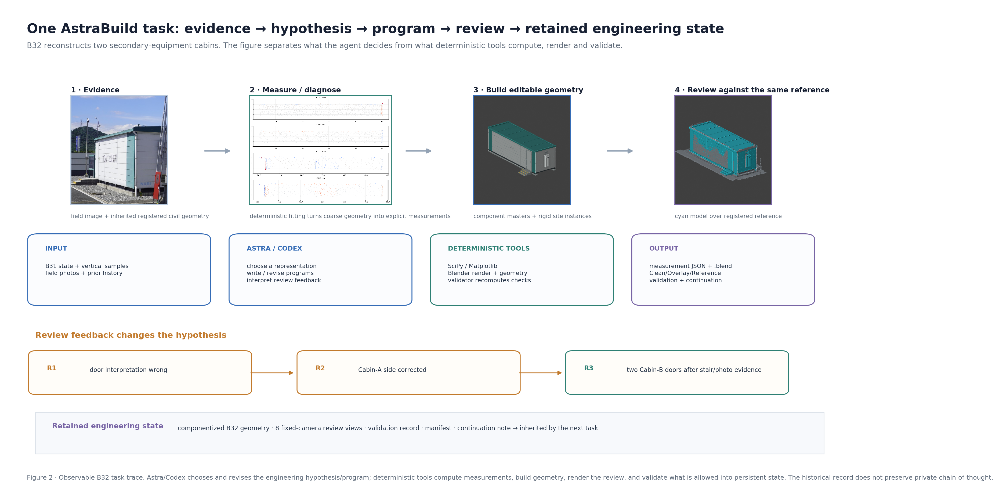
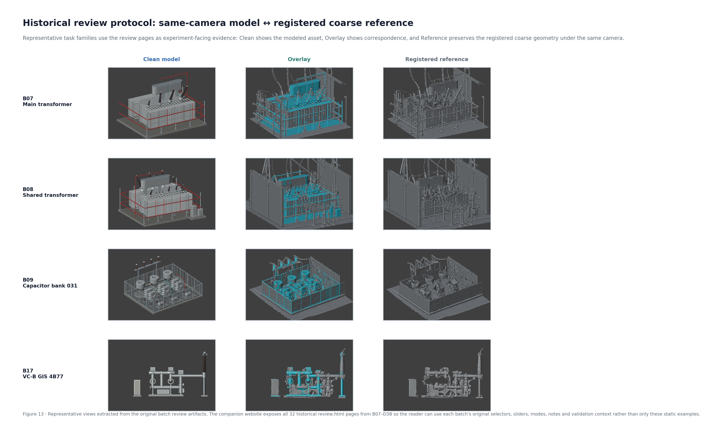
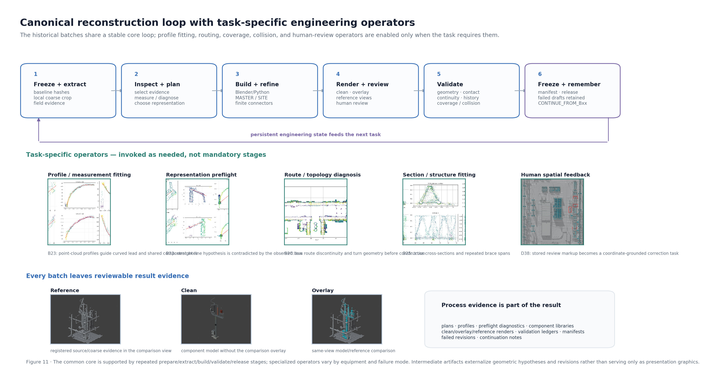
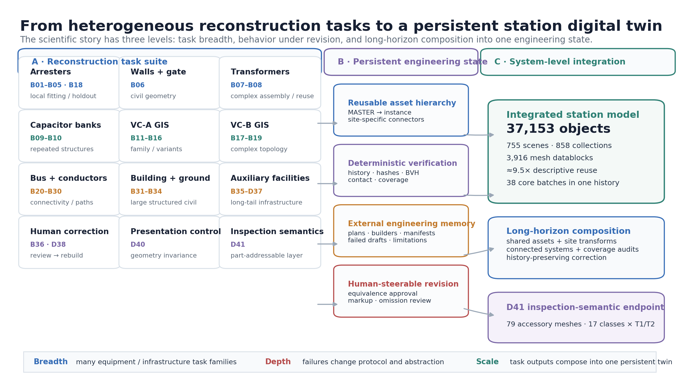
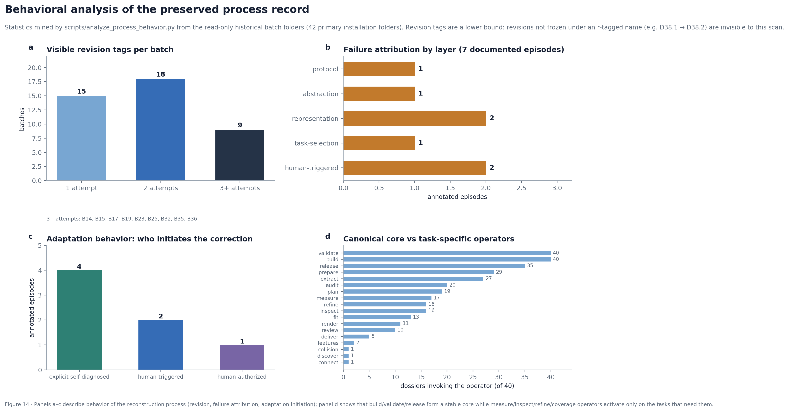

# AstraBuild: Evaluating GPT-6 Astra as a Long-Horizon 3D Engineering Agent Through Its Process Data

**Status:** analysis-report draft v0.8 (restructures the v0.7 advisor-discussion draft around behavioral analysis of the agent; same evidence base, same quantitative guardrails)
**Study site:** an anonymized operating substation
**Research endpoint:** D41
**Core geometry baseline:** D38.2
**Presentation-only geometry-preserving layer:** D40

> **Experiment-provenance note.** The project owner reports that the historical reconstruction process used **Codex + GPT-6 Astra with Extra High reasoning effort**. The inspected historical Blender batch files do not freeze model/reasoning-effort metadata. We therefore treat this configuration as **owner-confirmed experimental metadata**, not as provenance independently recoverable from the old batch logs.

---

## Summary

We evaluate whether **one general-purpose reasoning model** can work as a long-horizon 3D engineering agent: can the same agent solve heterogeneous component-level reconstruction tasks, and can the outputs of those tasks be composed into a persistent, evolving industrial digital twin? The model under test is GPT-6 Astra; the method is the harness around it — an evidence compiler, a Blender/Python programmatic action space, task-native deterministic validators, and a filesystem that serves as external engineering memory. Throughout this report, the harness is the method and the model is the variable under study; we do not attribute harness behavior to the model, or model behavior to the harness.

The evaluation setting is the longitudinal reconstruction of one operating operating substation: **38 core reconstruction batches** spanning **12 task families** (surge arresters, civil works, transformers, capacitor banks, two anonymized voltage classes GIS, bus and conductor systems, buildings and ground, auxiliary facilities, human-guided correction, presentation invariance, inspection-semantic augmentation). The batches are **not IID trials**: later tasks inherit geometry, reusable assets, validators, and recorded failures from earlier ones. We therefore report behavioral and task-native evidence, not a benchmark success rate.

Headline behavioral results, all mined from the preserved process record:

- **Revision is the norm, not the exception.** Of 42 primary installation folders, only 15 show a single preserved attempt; 18 show two, and 9 (B14, B15, B17, B19, B23, B25, B32, B35, B36) show three or more. A mean attempt count would describe no actual task.
- **Failures concentrate at the hypothesis layer.** Of 7 documented failure episodes, 5 are errors of protocol, abstraction boundary, representation class, or task-selection strategy — not parameter error. The agent's fluent first answer is frequently built on a wrong framing; the harness's job is to make that visible.
- **Adaptation is mostly explicit and traceable.** Of 7 adaptation episodes, 4 are self-diagnosed observe–diagnose–revise loops preserved as process files, 2 are triggered by sparse human signals, 1 required explicit human authorization. We observe no case where a silent, invisible correction would have been acceptable.
- **Negative results are preserved, not filtered.** B01 is a retained failed batch. The 5 cm screening ledger keeps **149 passing and 101 non-passing** items. A correction attempt (D38.1) introduced its own coordinate-semantics error before D38.2 fixed it. Two failed or superseded experiment variants (C37_failed_camera, D37_modified_1930) remain in the record. These are diagnostic evidence, and we report them as such.

Task-level and system-level outcomes (with their calibration): the internal geometry ledger holds **1,550 surface-comparison records** with median/p90/p95 residuals of **0.036/0.084/0.116 m** against the same photogrammetric mesh used as reconstruction evidence — **internal agreement, not independent survey accuracy**. Coverage-driven task selection reduced the unexplained >1 m sample fraction in audited high regions from **78.8% to 14.6%**. The composed station model at the D38.2/D40-equivalent layer contains **37,153 objects, 755 scenes, 858 collections, and 3,916 mesh datablocks** (descriptive reuse ratio ≈9.5×), and D41 adds **79 accessory meshes over 17 inspection-relevant part classes** to both transformer instances.

The central finding is behavioral: a general-purpose reasoning model can operate a persistent engineering process — it revises evaluation protocols, abstraction boundaries, representation classes, and task-selection strategies when evidence contradicts them, and it does so through traceable, preserved process artifacts. The evidence does not show full autonomy (human steering is material), survey-grade accuracy (no independent reference), or model superiority (no matched reruns). We state those boundaries rather than imply otherwise.

---

# 1. The agent under test, and the harness around it

## 1.1 The question is about the model, so the setup must not answer it for the model

"Can a general-purpose model do industrial 3D reconstruction?" is not a single question, because the model is never the whole system. A workflow in which the model writes one Python script per object and a human fixes the rest measures the human. A workflow in which a fixed pipeline fits primitives and the model only names parameters measures the pipeline. The interesting question sits between: what happens when the model must decide *what to build, how to measure it, when its current representation is wrong, and what to do next* — across months of interdependent tasks whose errors compound?

AstraBuild is the preserved record of exactly that arrangement. One agent/harness pair was exercised across the reconstruction of an operating substation, from surge arresters to a 37k-object station model with inspection semantics. Because the full process — inputs, programs, renders, validators, failures, revisions, continuations — was frozen batch by batch, the record supports a behavioral analysis of the agent, not only a gallery of its outputs.

## 1.2 A occupancy taxonomy for 3D engineering agents

Agentic 3D systems are easy to compare by name and hard to compare by function. We use a three-level taxonomy that separates systems by **what occupies the engineering decision path**, with executable membership criteria:

- **E1 — the model fills parameters.** A fixed pipeline decides what to build and how to check it; the model supplies values (dimensions, poses, labels). Criterion: replacing the model with a lookup table leaves the pipeline's structure untouched.
- **E2 — the model plans and executes.** The model writes the construction program and selects evidence, but validation criteria, revision logic, and task order are fixed in advance. Criterion: the trace contains model-written programs, but every revision is parameter-level and every task was scheduled by a human or a list.
- **E3 — the model also diagnoses and revises.** The model changes its measurement method, its abstraction boundaries, its representation class, or its task-selection strategy when evidence contradicts them. Criterion: the preserved record contains a revision that altered a *method or hypothesis*, traceable to a contradiction the pipeline surfaced.

Names carry information only if each level has an executable boundary; without one, every system drifts toward whichever label sounds most impressive. Under this taxonomy, AstraBuild sits at **E3**: B01→B02 revises the evaluation protocol itself (§5.1), B15 revises the reusable-asset boundary (§5.3), B23 revises the representation class (§5.4), B25/B26 revises task selection (§5.5). Each is documented by preserved process files, not by recollection. The taxonomy does not require autonomy: two of the seven adaptation episodes were initiated by sparse human signals, and one required explicit human authorization. E3 describes who revises the hypotheses, not who watches.

## 1.3 The harness is the method

The harness has four components, all deterministic except the model:

1. **Evidence compiler.** Each task receives a bounded evidence package assembled from the registered photogrammetric mesh, field photographs, engineering/semantic records (inventories, 12MZ groups), spatial priors, and the accumulated history of prior batches.
2. **Programmatic action space.** The model acts by writing or revising Blender/Python programs: extracting local reference geometry, fitting parametric subcomponents, building shared `MASTER` collections and site instances, routing finite connectors, rendering fixed-camera review views, and computing validation quantities.
3. **Task-native validators.** Deterministic checks decide whether a result enters persistent state, is revised, or is retained as a failed/limited artifact. At least eleven validation mechanisms recur: history preservation, site-transform preservation, SHA-256 protection, save/reopen checks, finite geometry, manifest replay, BVH reference-surface comparison, contact/support/endpoint continuity, camera framing, rigid-instance checks, and occupancy/coverage audits.
4. **External engineering memory.** The filesystem — plans, builders, validators, manifests, review renders, failed drafts, continuation notes — is the agent's long-term memory. Later tasks read what earlier tasks froze.

Formally, the persistent state after batch \(t\) is \(S_t=(M_t,A_t,H_t,X_t)\) — the editable scene, the reusable asset/instance hierarchy, the accumulated history, and the semantic mappings. The evidence compiler builds \(C_t=\mathcal{C}(G,I,R,U,H_t)\); the agent proposes \(a_t\sim\pi_{\mathrm{Astra}}(\cdot\mid S_t,C_t,f_{t-1})\); deterministic execution and validation decide what enters \(S_{t+1}\).

**Figure 1.** The harness is fixed; the model is the variable under test. Evidence enters through the compiler; the agent proposes programs; deterministic execution and validation decide what persists.

## 1.4 Protocol transparency

- **One model, one site, one longitudinal run.** 38 core batches through D38, plus the D40 presentation layer and the D41 semantic layer. No matched reruns with another model exist; comparisons to other systems are architectural, not empirical.
- **Batches are not IID.** Later tasks inherit state, assets, validators, and lessons. We do not report success rates over the batch sequence, and no number in this report should be read as one.
- **Model provenance is owner-confirmed.** Historical logs do not freeze the model identifier or reasoning effort (see the provenance note above).
- **Behavioral statistics are mined, not remembered.** Revision counts, failure-mode labels, and adaptation labels in §4 and §5 are produced by `scripts/analyze_process_behavior.py` over the read-only historical folders and stored in `release/behavior_analysis.json`. Filename-level revision tags are a **lower bound**: revisions not frozen under an r-tagged name (e.g. D38.1→D38.2, which is a release-level revision) are invisible to that scan.
- **Residuals are internal agreement.** The comparison surface is the same photogrammetric mesh that also guides reconstruction. No independent survey reference exists.

---

# 2. Evaluation protocol: a task suite, not an IID benchmark

## 2.1 What one task contains

Each task is a target equipment/infrastructure family, a bounded evidence package, the programmatic action space, and task-native validation criteria. A generic description is hard to interpret without seeing one, so we use B32 (two secondary-equipment cabins) as the observable trace: its folder preserves the inherited state, measurement scripts, diagnostic figures, three geometry revisions, componentized output, eight fixed-camera Clean/Overlay/Reference render sets, an interactive review page, an independent validator, and the continuation record consumed by the next task.

A provenance boundary matters here: the historical batches **do not preserve the model's private chain-of-thought**. What they preserve is an **observable engineering decision trail** — which evidence was selected, which program was written or revised, what the deterministic output was, what review or validation evidence contradicted the representation, and what changed next. All behavioral claims in this report are made over that observable trail.

**Figure 2.** One concrete task. The figure separates the agent's decisions from deterministic computation, rendering, and validation.

| Phase | Why this phase exists | Observable agent role | Deterministic execution and output |
|---|---|---|---|
| Freeze inherited state | B31 left the cabins unresolved; earlier work must not be overwritten | select B32 scope and preserve prior state | `prepare_B32.py` checks hashes/stats, writes `inputs_B32.json` |
| Measure cabin envelope | screenshot appearance is insufficient for metric pose/size | choose separate rectangular fits for C110/C220 and a fit/comparison split | SciPy soft-L1 least squares; facade diagnostics; `B32_container_measurements.json` |
| Diagnose visible details | fitted walls do not determine door count, side, or position | interpret stair/door evidence; revise the representation | `inspect_B32_steps.py`; review evidence drives R1→R2→R3 door corrections |
| Build componentized geometry | accepted measurements must become editable reusable structure | write/revise the construction program; decide reuse boundaries | `build_B32_r3.py`: shared end-wall/HVAC and door masters, C110/C220 masters, site instances, 27 renders |
| Same-camera review | one attractive render cannot reveal correspondence errors | interpret Clean/Overlay/Reference mismatch as revision evidence | 8 views × 3 modes; `B32_review.html` with mode switching and split slider |
| Validate and freeze | only checked artifacts should enter the next state | react to failed checks through revision, not silent acceptance | `validate_B32_r3.py`: inherited-state preservation (34,191 objects, 2,953 protected files), facade residuals, door/stair constraints, camera framing, asset round-trip |

The review chain materially changed the model's representation. R1 placed one door per cabin and put the C110 door on the wrong side; R2 moved C110 to the east side but kept one C220 west-side door; R3 uses one C110 east-side door (local Y≈−3.90) and two C220 west-side doors (≈−5.50 and +5.32). The continuation record notes that a C220 middle depression previously read as a door was rejected after photographs and two stair-platform signatures contradicted it. **The detail-level structure was the hard part, and it was resolved by review-driven revision, not by the first fit.** Section 4 returns to this pattern at suite level.

## 2.2 The review protocol is part of the measurement instrument

B32 is not an isolated mechanism. The process catalog indexes **32 formal batches with original `review.html` pages from B07 through D38**, generated during the experiments and embedding their own renders. The recurring interface is stable: named equipment/view selector, modeled geometry under a fixed camera, the registered reference under the same camera, overlay or split-slider comparison, and batch-specific notes on what is modeled, what is uncertain, and which validation quantities are meaningful.

**Figure 3.** Representative views extracted from the original review artifacts. The companion website exposes all 32 historical review pages with their original selectors, sliders, and notes, rather than static excerpts.

These pages are part of the evaluation instrument, not its documentation: they are what the agent produced for review, and what review evidence (including human markup in D38) later modified. A folder-level scan finds 33 review pages; the 33rd belongs to C37, whose failed-camera variant was superseded by D37 and which is therefore outside the formal catalog.

## 2.3 The canonical core and its task-specific operators

The B01–B36 script and output folders support a specific process model. The recurring core is: freeze/prepare inherited state; extract a registered local reference; inspect and plan; build/refine geometry, masters, instances, or connectors; render review evidence; validate task-native conditions; freeze the batch and externalize memory. Around this core, operators activate only when the geometry or a failure demands them: measurement/profile fitting (B23), route diagnostics (B20), structural profiles and coverage reasoning (B25), human-markup registration (D38).

A filename-level audit of the 40-dossier process catalog gives the operator distribution: `build` 40/40, `validate` 40/40, `release` 35/40, `prepare` 29/40, `extract` 27/40, `audit` 20/40, `plan` 19/40, `measure` 17/40, `inspect` 16/40, `refine` 16/40, `fit` 13/40, `render` 11/40, `review` 10/40, and single-digit invocations for `connect`, `collision`, `discover`, `features`, `deliver`. (The 40-dossier scope differs from the 36-batch audit reported previously; both are workflow-record counts, not success rates.) The stable core carries state; the operators carry judgment calls.

**Figure 4.** The stable core carries state between tasks. Specialized operators are activated by equipment geometry or by failure.

## 2.4 The task suite

| Task family | Batches | Representative target/output | Capability exercised | Representative recorded evidence |
|---|---|---|---|---|
| Surge-arrester fitting | B01–B05, B18 | SA110/SA220 bodies and installation | local fitting, pose/scale, held-out checking | B01 preserved failure; B02 naked-shaft RMS 1.8–3.4 cm under revised domain* |
| Wall and gate | B06 | station wall + gate | large civil geometry from coarse reference | east-wall median reference distance 7.87 m→0.015 m |
| Transformer reconstruction | B07–B08 | two main transformers | complex assembly, reusable abstraction | shared T1/T2 assembly; bank median ~0.01 m; T2 front P95 0.62 m tail retained |
| Capacitor-bank reconstruction | B09–B10 | six 35 kV capacitor groups | repeated structures, local assemblies | 18 lane medians 0.6–2.4 cm; first broad outdoor coverage audit |
| VC-A GIS/device families | B11–B16 | GIS bays, arresters, bus-tie/VT structures | reusable families and variants | B13: seven GIS sets, ~2,400 expanded meshes |
| VC-B GIS/outgoing families | B17–B19 | outgoing bays and variants | cross-family reuse, complex topology | B17: 75 local checks, 50 pass / 25 retained non-pass |
| Bus and conductor systems | B20–B30 | busbars, drops, insulator strings | explicit connectivity, flexible paths | ~88.8 m busbar; 804 discs; endpoint continuity ~1e-6 m |
| Building and ground | B31–B34 | main building + ground | large structured civil reconstruction | building: 946 components; ground ~10,182 m²; wall-domain RMS 1.8–3.2 cm |
| Auxiliary facilities | B35–D37 | CCTV, fence, bus racks, floodlights, manholes | long-tail infrastructure and revision | B35 multi-revision path; omission audit triggers B36 |
| Human-guided correction | B36, D38 | missing bus rack; false cabinets; missing GIS/fire room | history search, markup-to-3D correction | D38: markup registration NCC 0.94/0.92, coordinate-grounded correction |
| Presentation invariance | D40 | PBR material layer | appearance change under frozen geometry | 37,153 objects / 29,986,649 vertices unchanged |
| Inspection-semantic augmentation | D41 | transformer inspection accessories | part-addressable semantic augmentation | 79 accessory meshes, 17 selected classes × T1/T2; validation `ok=true` |

\*All residual values are internal agreement with the correlated photogrammetric reference, not independent survey accuracy.

**Figure 5.** The evaluation organization: heterogeneous tasks feed one persistent engineering state; the composed station tests whether task-level outputs survive composition.

---

# 3. Task-level results: a capability ladder

Read as a ladder, the suite separates what the agent does reliably from what it does only under review. The rungs below are ordered by how much review-driven revision the preserved record shows.

**Rung 1 — Semantic grounding is reliable.** Inventory names, 12MZ groups, and inspection concepts were attached to geometry with explicit accounting rather than forced completeness: 151 devices in the part map, 76 of 106 official names attached, 30 left unmatched. A later semantic audit caught naïve string/box attachments (cross-bay bus tubes, misidentified arresters/switches) and revised them.

**Rung 2 — Metric envelope fitting is reliable when a measurement operator runs.** Where the agent compiled a local registered reference and fitted parametric envelopes — walls (east-wall median 7.87 m→0.015 m), capacitor lanes (18 medians 0.6–2.4 cm), building wall domains (RMS 1.8–3.2 cm), the B32 cabin envelopes — the resulting geometry lands at centimeter-level internal agreement. These fits are deterministic computations; the agent's contribution is deciding *what to fit, on which domain, with which split*.

**Rung 3 — Fine visible detail needs review rounds.** Door count/side/position in B32 required R1→R2→R3 corrections driven by same-camera review; the B01 arrester failure came from accessory geometry contaminating the comparison domain; T2's front retains a P95 0.62 m residual tail that summary statistics would hide. Detail errors are semantic-perceptual (what is this feature?), not numeric.

**Rung 4 — Connectivity and coverage need dedicated operators.** Bus/conductor systems required route diagnostics and endpoint-continuity checks (B20; continuity ~1e-6 m); unknown omissions required the coverage audit as an active sensor (B25/B26). Neither emerges from per-device fitting.

The quantitative ledger, with its calibrations: **1,550 surface-comparison records**, median/p90/p95 **0.036/0.084/0.116 m** (internal agreement, correlated reference); a 5 cm screen retaining **149 passing / 101 non-passing** items (non-passing items are kept in the accounting, not deleted); coverage audit of selected high regions **78.8%→14.6%** for >1 m unexplained samples, with GIS-B median 8.12→0.15 m and transformer median 3.15→0.06 m (audited regions, not whole-station completeness).

**Figure 6.** Residuals, retained screening items, and coverage-gap measurements answer different questions and are reported separately.

---

# 4. Behavioral findings

The task table shows what was built. This section analyzes how the agent behaved, using statistics mined from the preserved record (`release/behavior_analysis.json`, produced by `scripts/analyze_process_behavior.py`) and the seven documented behavioral episodes.

**Figure 7.** (a) Visible revision tags per batch across 42 primary installation folders; (b) failure attribution by layer across the 7 documented episodes; (c) who initiates adaptation; (d) operator prevalence showing the stable core and the task-specific operators.

## Finding 1 — Revision is the norm, and the hard tail is real

Of 42 primary installation folders, 15 show a single preserved attempt, 18 show two, and 9 — B14, B15, B17, B19, B23, B25, B32, B35, B36 — show three or more. The distribution has no meaningful average: a routine majority and a hard tail are different populations. The hard tail is not random: it concentrates on reusable abstractions (B15, B17, B19), flexible/representational geometry (B23, B25), review-heavy detail (B32), and omission recovery (B35, B36) — exactly the rungs 3–4 capabilities of §3.

Two calibrations. First, filename-level tags are a lower bound: D38's correction cycle (D38.1→D38.2) is a release-level revision invisible to the scan. Second, the absence of a tag is not the absence of failure: B01 shows one attempt because the failed batch was preserved and the fix landed in B02's protocol change.

## Finding 2 — Failures concentrate at the hypothesis layer, not the parameter layer

Annotating the seven documented failure episodes by the layer at which the error lived: evaluation **protocol** (B01: the comparison domain mixed target shaft with accessory geometry), **abstraction** boundary (B15: finite site-specific bus geometry inside a shared master), **representation** class (B23: straight-lead hypothesis contradicted by a measured half-meter mid-span bow; D38.1: registration yaw mistaken for equipment orientation), **task selection** (B25/B26: inventory lists cannot surface unknown omissions), and human-surfaced **omission** (B36, D38). Five of seven are hypothesis-level errors. In none of them would tuning a dimension have fixed the problem; in all of them the fix was to change what was being assumed.

This is the report's central behavioral observation, and it cuts both ways. It shows fluent reasoning going wrong at exactly the layer where deterministic checks are weakest — a validator can measure a residual but cannot know that the domain was misdefined. And it shows the harness doing its job: every one of these errors was surfaced by preserved evidence (a held-out screen, an overlap, a measurement profile, a coverage audit, a markup) and revised in a later, also-preserved artifact.

## Finding 3 — Adaptation is explicit, or it did not happen

Of the seven adaptation episodes, four are **explicit self-diagnosed** loops (B01→B02, B15, B23, B25/B26): the observe–diagnose–revise chain is visible as process files — profiles, preflights, route diagnostics, coverage audits — that a reader can inspect independently of any narrative about them. Two are **human-triggered** (B36, D38): a compact spatial signal from a reviewer initiates a multi-step engineering response. One is **human-authorized** (B08): the reusable transformer master exists because a user explicitly authorized treating T1/T2 as equivalent.

We did not observe, and under this harness would not expect to observe, silent in-flight adaptation that leaves no trace: the canonical loop freezes evidence and output at each step. Whether the model would adapt as well without the frozen-evidence discipline is a question this record cannot answer; we state that rather than claim it.

## Finding 4 — The reference geometry became a sensor

The B25/B26 transition is the clearest strategic adaptation in the record. Earlier work follows inventory lists; an inventory cannot list what nobody recorded. The coverage audit inverted the question — from "which entry is unresolved?" to "where does the coarse reference contain geometry the model does not explain?" — and turned the reference mesh into an omission sensor. In the audited high regions, the >1 m unexplained-sample fraction moved from 78.8% to 14.6%, with the GIS-B median from 8.12 m to 0.15 m and the transformer median from 3.15 m to 0.06 m.

The calibrated reading: these are audited regions, not whole-station completeness, and the reference is the same correlated mesh. The behavioral reading: task selection — a decision about *what to work on next* — was revised by the agent's own evidence machinery. That is an E3 behavior under the §1.2 taxonomy, and it is the episode that most distinguishes this record from a pipeline executing a list.

## Finding 5 — Sparse human signals trigger multi-step engineering responses

Human input in this record is compact and spatial, never vertex-level: an equivalence authorization (B08), a top-view omission report (B36), marked regions on review images (D38). Each triggered a long agent-side chain. D38 is the most complete: marked images registered to the original views at NCC ≈0.94/0.92, review-camera mapping inverted to model coordinates, three false cabinet groups quarantined (not deleted), three GIS gaps and the fire-room structures rebuilt — and then D38.1's orientation-semantics error caught by overlay review and corrected in D38.2.

The division of labor is consistent: humans supply error signals and authorizations; the agent performs history search, geometric reconstruction, revision, and verification. The supported claim is **agent-driven, human-steerable** reconstruction — and notably, the correction loop itself is not infallible (D38.1), which is why corrections go through the same review protocol as original work.

## Finding 6 — Composition is a separate capability, and it is where state discipline pays

Composing task outputs into one station model is not concatenating meshes. It requires that shared masters stay shared only where equivalence holds (B15 is the counterexample), that finite site-specific connectors stay out of global masters, that previous transforms and objects survive later batches (B32's validator checks 34,191 inherited objects and 2,953 protected files), that bus/conductor endpoints stay connected to equipment from earlier tasks, that coverage audits expose structures never listed as tasks, and that human corrections modify the active model while preserving rejected geometry.

The record shows this discipline holding at scale: 2,859+ protected-file hashes by the B35-era chain; failed variants (C37_failed_camera, D37_modified_1930) preserved rather than cleaned up; the D40 material layer validated to leave all 37,153 objects and 29,986,649 vertices unchanged, so that a better-looking render cannot be misread as new geometry. The composed artifact — 37,153 objects, 755 scenes, 858 collections, 3,916 mesh datablocks, reuse ratio ≈9.5× — is the system-level result; the layered endpoint (D38.2 geometry / D40 presentation / D41 semantics) is what keeps the result interpretable.

**Figure 8.** Representative failures alter later protocol, abstractions, reconstruction logic, or feedback interpretation rather than being silently discarded.

---

# 5. Behavioral episodes

The findings above aggregate; this section preserves the episodes themselves, because in a non-IID longitudinal study the episodes *are* the evidence. Each is stated as: trigger → diagnosis → revision → what it shows.

## 5.1 B01→B02: the evaluation domain is itself a hypothesis

B01 installs three arrester candidates. Source hashes and transform checks pass, but held-out cylindrical-domain RMS values of ~0.048/0.073/0.051 m violate the 5 cm screen; the batch is retained as failed. The diagnosis: the comparison domain mixes the target shaft with protruding accessories. B02 separates fitting and holdout regions, and the historical notes explicitly state the revised metric is not directly comparable to B01. **The protocol, not the parameters, was wrong — and the failed batch was kept.**

## 5.2 B08: reuse begins with an explicit equivalence authorization

B07 reconstructs part of the #1 transformer exterior. After the user explicitly authorizes treating the two transformer assemblies as equivalent, B08 introduces a shared `MASTER` and T1/T2 site instances; later structural edits propagate consistently. Validation keeps the T2-front P95 ≈0.62 m residual tail visible. Reuse here is a hypothesis about equivalence — adopted deliberately, with its counter-evidence retained.

## 5.3 B15: the reusable abstraction is falsified

B15's local measurement procedure is contaminated by neighboring equipment; separately, the first shared bus-spool master extends identical finite geometry across installations whose physical extents differ, overlapping adjacent equipment. Recovery revises two levels at once: the measurement method, and the MASTER/site boundary (site-specific segments removed from the master; obsolete supports archived, not overwritten). A reusable library is a geometric hypothesis, and field evidence falsified this one.

## 5.4 B23: measurement profiles change the representation class

B23 inherits a preflight treating a neutral-side connection as a straight segment; the registered coarse geometry shows a ~0.5 m mid-span bow. The agent bins the observed geometry, extracts control points, and fits a smooth curved path with fixed endpoints. The revision history is informative: r1 worsens one validation domain (older geometry had accidentally covered the soft connection), r2 adds the soft lead, r3 adds lower bridge contact; the final record evaluates 32 fixed triangle domains with 30 meeting the 5 cm screen and two retained misses. The process folder preserves the measurement profiles, the preflight graphic, the 3,800-line fitted-geometry plan, render triplets, manifests, and the initial/r2 validation chain.

## 5.5 B25/B26: task selection shifts from inventory to unexplained geometry

See Finding 4. The episode additionally produced the first explicit coverage-driven task queue: structures absent from any inventory entry were scheduled because the reference mesh contained unexplained occupancy.

## 5.6 B36: a sparse omission report becomes a multi-revision rebuild

A top-view reviewer reports missing low bus racks. The agent opens an audit-only path, searches historical logic, and traces the omission to an earlier decision that treated the structure as outside the transformer assembly. Reconstruction then takes three revisions: a non-finite path section, a section-orientation fix, and a 0.16 m shift of one incoming segment to avoid a fire pipe. The human supplied four words' worth of spatial signal; the agent supplied the archaeology, the geometry, and the verification.

## 5.7 D38: 2D markup becomes traceable 3D correction — and correction is itself correctable

The most complete human–agent episode (Finding 5). Trigger: marked review images. Chain: registration (NCC ≈0.94/0.92) → coordinate inversion → diagnosis → quarantine of three false cabinet groups → rebuild of three GIS gaps and the fire-room/sand-box structures → overlay review catches D38.1's yaw/orientation confusion → D38.2 corrects it. Both the original generation error and the intermediate correction error remain in history.

**Figure 9.** Sparse 2D markup is transformed into a traceable sequence of registration, coordinate inference, diagnosis, quarantine/rebuild, and review.

---

# 6. System-level composition and the semantic endpoint

## 6.1 The station model

At the D38.2/D40-equivalent layer the composed project contains **37,153 objects, 755 scenes, 858 collections, 3,916 mesh datablocks, and 29,986,649 vertices**, with a descriptive object-to-mesh reuse ratio of ≈9.5×. Reconstructed coverage summarized in the technical report includes 48 arrester bodies, 8+3 GIS bays, two main transformers, six capacitor groups, ~88.8 m of busbar, 804 insulator discs, ~10,182 m² of ground surface, and a 946-component main building. These counts demonstrate the breadth of operations carried out by one persistent process; they do not imply that every physical object is independently verified.

## 6.2 Inspection semantics as the research endpoint

At station level, the part map contains 151 devices, with 76 of 106 official names attached and 30 deliberately left unmatched. For the #1 transformer pilot, 189 semantic meshes group into 26 part classes; the 36 official inspection concepts decompose into 31 model-part points, 4 external-component points, and 1 non-visual operating-sound concept. D41 then selects **79 accessory meshes covering 17 missing inspection-relevant part classes**, aligns them to the B08 tank frame, stores them as one shared collection, instantiates them into both T1 and T2 through the existing site transforms, and validates `ok=true` (79/79 structure and count checks, 17/17 class coverage for both instances).

**Figure 10.** The endpoint layer: from reconstruction tasks through station composition to component-addressable inspection semantics.

## 6.3 Version boundary

- **D38.2:** principal reconstructed station geometry after the correction loop;
- **D40:** material/presentation layer, validated to preserve geometry, transforms, object counts, and vertex counts;
- **D41:** additive inspection-semantic accessory layer.

The layering prevents a better-looking render from being misreported as new geometry and prevents later semantic additions from being back-projected into earlier results.

---

# 7. What this evaluation does and does not show

**Supported.** A general-purpose reasoning model, inside a deterministic evidence/validation harness, can operate as a persistent 3D engineering agent across 12 heterogeneous reconstruction task families at one real industrial site. The behavioral specifics matter more than the summary: it revises hypotheses at the protocol, abstraction, representation, and task-selection layers when evidence contradicts them (Findings 1–4); it converts sparse human spatial signals into verified multi-step corrections (Finding 5); and its task outputs compose into one editable, semantically extensible station model (Finding 6).

**Not supported.** Full autonomy — human steering is material and documented (§5.2, §5.6, §5.7). Survey-grade accuracy — all residuals are internal agreement with the correlated photogrammetric reference; no independent survey exists. Model superiority — no matched reruns with another model, a specialized 3D pipeline, or a human CAD baseline were performed. Cross-site generality — one substation, one data-acquisition protocol. The analogy to embodied-agent evaluations (shared environment, task suite, behavioral episodes, long-horizon demonstration) is an analogy of reporting structure, not of statistics: these are not repeated randomized episodes, and the validators are heterogeneous by design.

**What would change the picture.** Matched reruns under the same harness with a second model; an independent LiDAR/total-station reference on a subset of equipment; a second site; per-batch cost ledgers (tokens, wall-clock, human minutes), which the historical record does not contain and which future controlled studies should freeze along with model/version provenance.

---

# 8. Limitations

**Single-site external validity.** All task families come from one substation; diversity within one site does not establish transfer.

**No independent survey reference.** Headline centimeter-scale residuals compare against the same mesh that guided reconstruction. They are not independent survey accuracy.

**Heterogeneous task-native validators.** Appropriate for an engineering case study; it prevents reduction to one stationary benchmark success rate.

**Human steering is material.** Equivalence authorization, omission review, image markup, and semantic audit all influenced the trajectory.

**Owner-confirmed model provenance.** Historical logs do not freeze model identifier or reasoning effort. Future studies should log model/version, reasoning setting, tool versions, evidence manifest, token usage, wall-clock, human interventions, and output hashes per run.

**Behavioral mining is filename-level.** Revision counts are lower bounds; failure-mode and adaptation labels are manual annotations of documented episodes, reported with their sources, not derived measurements.

---

# Appendix A. Version boundary

| Layer | Role | Interpretation |
|---|---|---|
| D38.2 | principal station geometry | main geometry/count baseline |
| D40 | PBR/material presentation | geometry-preserving presentation control |
| D41 | transformer accessory/inspection augmentation | additive research endpoint |

# Appendix B. Quantitative guardrails

- `3.6 cm` = median residual to the same photogrammetric reference mesh; **not absolute/survey accuracy**.
- `149 / 101` = retained 5 cm screening-item counts; **not a model success rate**.
- `78.8% → 14.6%` = selected high-region >1 m gap fraction; **not whole-station completeness**.
- `9.5×` = descriptive object/mesh-datablock reuse ratio; **not a measured modeling-speedup**.
- `37,153 objects` = Blender scene scale; **not 37,153 independently verified physical components**.
- `D41 17 classes` = selected transformer inspection-semantic augmentation; **not complete station-wide part semantics**.

# Appendix C. Behavioral-statistics scope

- Revision statistics derive from a read-only scan of 42 primary installation folders (B01–B36, C37, D37, D38, D40, D41, R01) via `scripts/analyze_process_behavior.py`; `_rN` file tags and `rN/` directories are a lower bound on revision behavior.
- The scan counts 72 validation JSON files, 76 manifest files, and 33 review pages inside those folders. Project-wide totals reported elsewhere (71 validation JSON files, 150 manifests, 32 formal review pages) use different scopes: the formal catalog excludes the superseded C37 review page, and project-wide manifest counts include release-level records outside the installation folders.
- Operator prevalence uses the 40-dossier process catalog; the 36-batch audit cited in earlier drafts has a different scope. Both are workflow-record counts.
- Failure-mode and adaptation labels are manual annotations of the documented episodes in §5, embedded with sources in the mining script.

# References

Use the existing `references.bib`. The framing references most relevant to this draft are GPT-Policy [@cheng2026gptpolicy], the GPT-6 Astra embodied-policy technical report [@su2026astraembodied], RoboDojo [@chen2026robodojo], SceneCraft [@hu2024scenecraft], 3D-GPT [@sun2023threegpt], foundational photogrammetry/neural-reconstruction work [@schonberger2016sfm; @mildenhall2020nerf; @kerbl2023gaussians], and programmatic/tool-using model work [@liang2023code; @huang2023voxposer].
