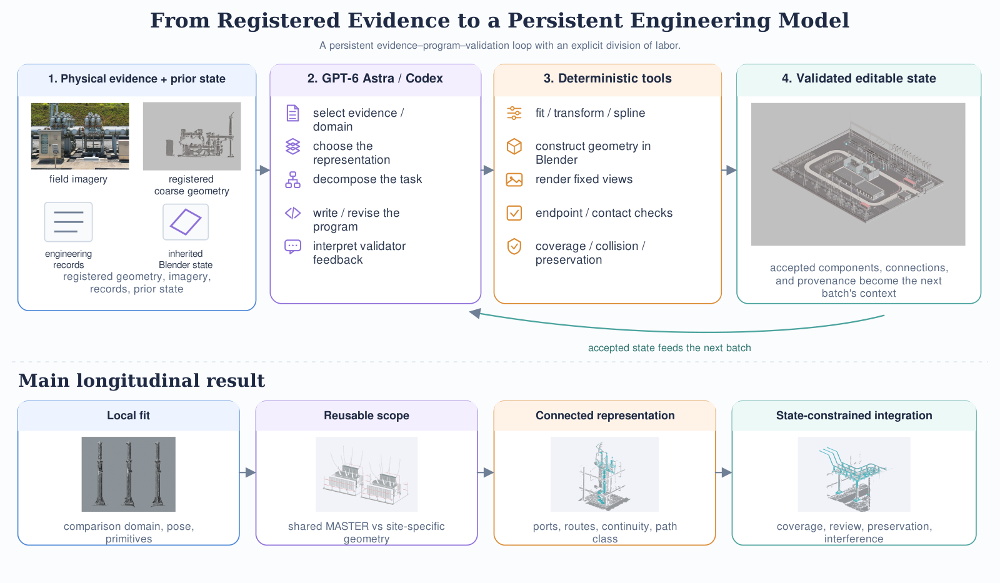
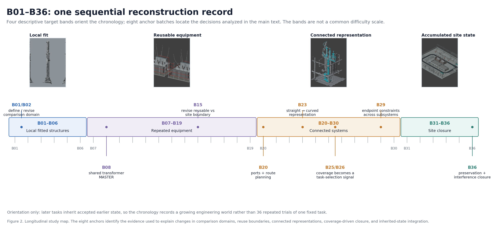
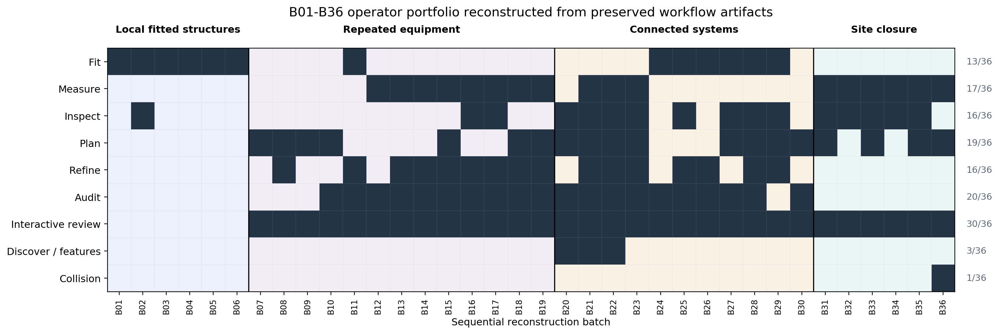
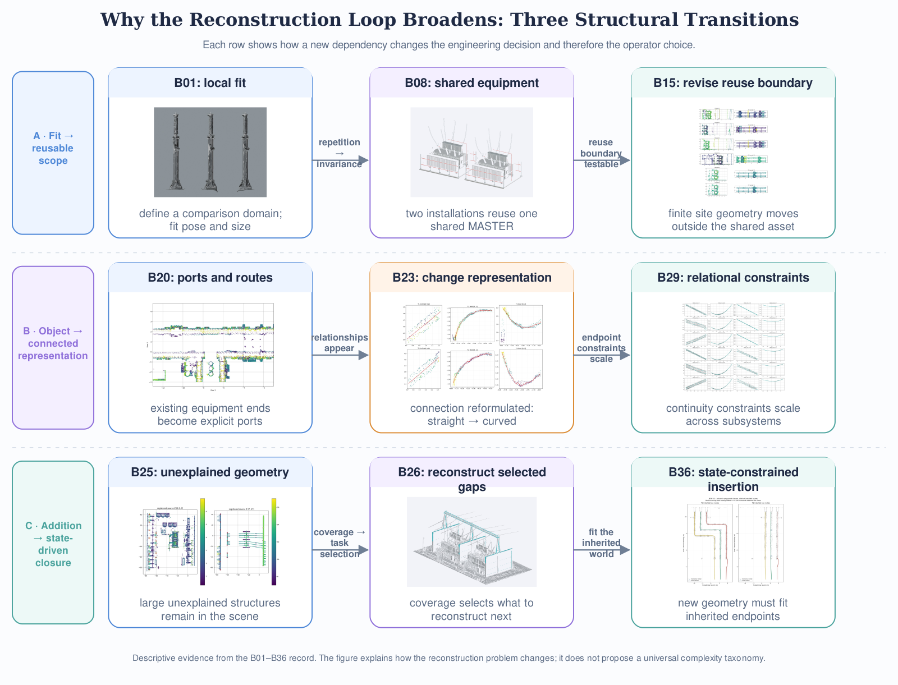
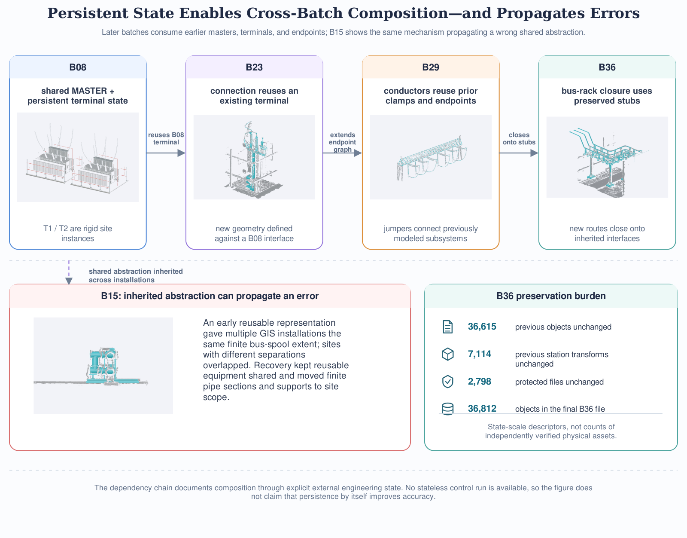
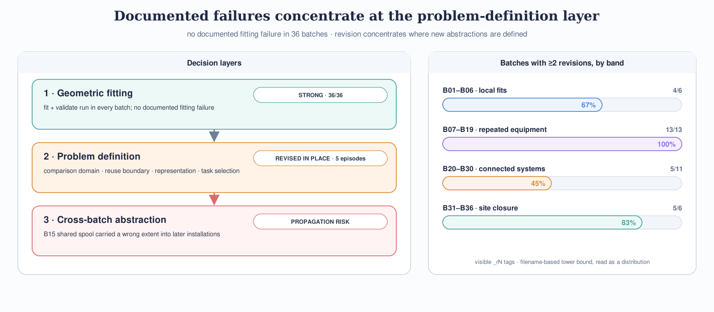
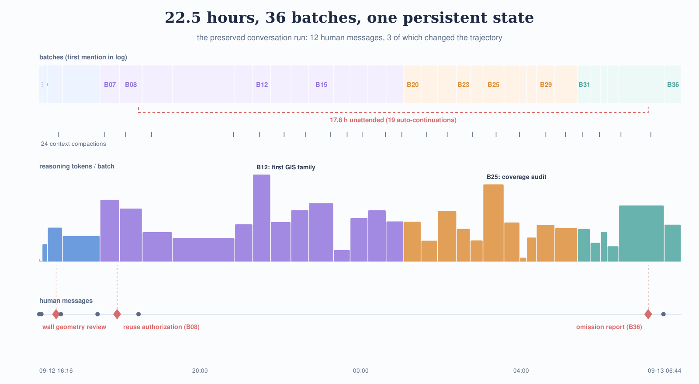

---

# Abstract

Industrial 3D reconstruction is often framed as recovering geometry from observations, but an editable engineering model presents a different systems problem: component reuse, connection constraints, representation choices, and prior state all change as reconstruction proceeds. We ask how a general-purpose reasoning model can coordinate this evolving process through explicit geometry programs and task-specific validation. We study GPT-6 Astra/Codex over B01–B36, a 36-batch reconstruction of one anonymized operating substation from registered photogrammetric geometry, field imagery, engineering records, and inherited Blender state. The record shows that local fitting remains useful throughout the sequence, while the required operator portfolio broadens as dependencies accumulate. Repeated equipment introduces decisions about reusable versus site-specific geometry; connected systems introduce ports, routes, continuity, and flexible path representations; later site work adds coverage-based omission discovery, review, preservation, and interference constraints. Numerical estimation and acceptance are performed by deterministic geometry code, while the model's observable role is to select evidence and representations and to author or revise the corresponding operations. Persistent external state enables later tasks to reuse earlier masters, terminals, and connections, but also propagates erroneous shared abstractions until they are revised. The study characterizes one longitudinal field reconstruction; it does not establish model superiority, independent survey accuracy, or cross-site generalization.

---

# 1 Introduction

Photogrammetry can recover a registered geometric description of a large physical site, but the resulting surface is not yet an editable engineering model [@schonberger2016sfm]. Engineering reconstruction requires additional structure: repeated equipment should share reusable components where appropriate; finite installation geometry must remain site-specific; conductors and busbars must terminate on explicit interfaces; and later edits must preserve geometry that has already been accepted. Industrial facilities make these requirements especially visible because a single scene contains rigid equipment, repeated assemblies, flexible connections, buildings, and auxiliary infrastructure whose representations obey different constraints.

The resulting task is poorly described as one fixed 3D reconstruction mapping. A cylindrical arrester can be approached through local fitting, whereas a transformer assembly requires decisions about reusable structure, a conductor requires endpoints and a path representation, and late site closure requires identifying unexplained geometry while avoiding interference with an accumulated model. The numerical procedures for these tasks are well understood individually: fitting, coordinate transforms, spline construction, distance queries, contact tests, and collision checks can all be implemented deterministically. The open systems question is how to formulate, select, and revise those operations as the target changes while retaining a coherent engineering state.

We study this question through AstraBuild, a GPT-6 Astra/Codex reconstruction workflow applied to one anonymized operating substation. The analysis uses the preserved B01–B36 sequence, comprising 36 sequential batches that begin with local equipment placement and progress through repeated equipment families, connected bus and conductor systems, civil structures, and late residual site work. Each batch operates through executable Blender/Python procedures and task-specific validation, and later batches inherit geometry and interfaces produced earlier. We ask: **how does a persistent general-purpose reasoning workflow change as industrial 3D reconstruction progresses from local fitting to reusable equipment, connected representations, and state-constrained site closure, and what role does the persistent engineering state itself play in that change?**

The B01–B36 record supports three answers (Figure 1). First, geometric computation and acceptance remain explicit outside the language model. The observable model/harness contribution lies in selecting evidence and comparison domains, choosing representations and decompositions, and authoring or revising the programs that invoke deterministic geometry operators. Second, the operator and decision portfolio broadens as dependencies accumulate. Local fitting remains present, but repeated equipment adds decisions about invariance and installation scope, connected systems require explicit relationships among existing geometry, and later closure requires selecting and inserting residual work within an accumulated scene. Third, persistent external engineering state makes these dependencies compositional. Later batches reuse earlier masters, terminals, transforms, and connection endpoints, while a mistaken shared abstraction can propagate until its reuse boundary is revised.

These findings motivate a view of agentic reconstruction as persistent orchestration of specialized geometry operations. The central scientific object is the changing reconstruction problem represented in the saved programs and engineering state, rather than the final station model alone. This interpretation also constrains attribution: centimeter-scale residuals reported in individual tasks arise from explicit geometry procedures and are not measures of intrinsic numerical precision in the language model. The study likewise does not establish learning across batches, model superiority, station-wide survey accuracy, or cross-site generalization.

The paper makes three contributions. **(1) Persistent reconstruction formulation.** We formulate component-level industrial reconstruction as a sequence of model-authored or model-revised executable operations over registered evidence and inherited engineering state, with deterministic tools responsible for geometric computation and validation. **(2) Longitudinal B01–B36 field record.** We organize 36 sequential reconstruction batches into a compact study of local fitting, reusable equipment, connected systems, and site closure while retaining the original task-specific evidence and revision history. **(3) Cross-sequence systems analysis.** We show that the documented operator portfolio broadens as reconstruction dependencies accumulate and that persistent external state provides both the mechanism for cross-batch composition and a propagation surface for erroneous shared abstractions.

*Figure 1. AstraBuild as a persistent evidence–program–validation workflow. Registered physical evidence and inherited engineering state condition a model-authored or model-revised operation; deterministic tools execute geometry construction and task-specific checks; accepted output becomes part of the next reconstruction context. The lower progression previews the paper's longitudinal result: the common loop persists while additional representation and integration decisions appear as dependencies accumulate.*

---

# 2 Related work

## 2.1 Structured reverse engineering from 3D observations

AstraBuild shares with CAD reverse-engineering research the goal of converting sampled geometry into an editable, structured representation. Point2CAD reconstructs structured CAD surfaces and topology from point clouds through a hybrid analytic-neural pipeline [@liu2024point2cad]. CAD-Recode instead predicts executable Python code that reconstructs a parametric CAD sequence from point-cloud input [@rukhovich2024cadrecode]. These methods make structure, editability, and executable representations part of the reconstruction target rather than treating a sampled surface as the final output.

The setting considered here differs in scale and task structure. B01–B36 spans equipment assemblies, finite site connections, flexible conductors, and civil structures inside one inherited station scene. The desired representation changes across those tasks, and later geometry is constrained by components and endpoints produced earlier. AstraBuild therefore studies a persistent sequence of heterogeneous reverse-engineering operations rather than a fixed object-level mapping from a point cloud to one CAD representation.

## 2.2 Language models for programmatic 3D construction

3D-GPT and SceneCraft provide direct precedents for using language models to express 3D construction through executable programs. 3D-GPT decomposes procedural modeling into cooperating language-model roles that produce Blender operations [@sun2023threegpt]. SceneCraft constructs a scene graph, translates spatial relations into numerical constraints and Blender code, renders the resulting scene, and iteratively refines it through visual feedback [@hu2024scenecraft]. Both demonstrate that language models can operate over procedural 3D abstractions rather than outputting only text descriptions.

AstraBuild uses a similar executable interface for a different inference direction. Its target is a registered physical site whose geometry, component reuse, and connections are constrained by photogrammetric reference data, field images, engineering records, and previously accepted state. Program execution is followed by task-specific geometric validation, and the accepted result becomes part of the next reconstruction problem. The central question is consequently how a general-purpose model organizes changing reverse-engineering operations under physical and inherited constraints, rather than how well a language description can be synthesized into a plausible scene.

## 2.3 Long-horizon tool-using agents

Long-horizon agents provide a second conceptual precedent. Voyager combines executable code, environment feedback, iterative program improvement, and a persistent skill library in an open-ended embodied environment [@wang2023voyager]. Code as Policies similarly treats language-model outputs as executable programs that compose API-level actions [@liang2023code]. GPT-Policy studies a vision-language model acting through a constrained controller while conditioning on examples, demonstrations, feedback, and persistent run context [@cheng2026gptpolicy]. These systems motivate an experimental view in which a model is evaluated through its interaction with explicit tools and state rather than by an isolated text response.

AstraBuild applies that view to reverse engineering of a physical industrial site. Its action space consists of reconstruction programs and engineering operators; its feedback includes registered geometry, rendered comparisons, task-specific validators, and inherited scene state. Existing work therefore supplies three complementary precedents: structured reverse engineering, executable 3D generation, and long-horizon tool use. B01–B36 records their interaction within one persistent industrial reconstruction process.

## 2.4 Engineering-model reconstruction practice and agent memory

Two further bodies of practice border this study. Converting sampled geometry into structured, editable facility models is an established engineering problem: the scan-to-BIM literature reviews pipelines that reconstruct building information models with named components, connections, and provenance from laser-scanned point clouds [@tang2010scanbim], and industrial digital-twin practice assumes persistent, editable models that accumulate state over a facility's lifetime. AstraBuild shares the target representation with this literature but differs in who authors the operations: the reconstruction operations here are formulated and revised by a general-purpose reasoning model rather than by fixed conversion pipelines or human modelers. Separately, persistent external memory is an established architectural element in agent systems, from Voyager's skill library to retrieval-based episodic memory in generative agents [@park2023generative] and operating-system-style memory hierarchies for language models [@packer2023memgpt]. What those works do not provide is a longitudinal field record of how such state is used, and how it fails, when the stored content is validator-checked engineering geometry rather than text. Relative to both literatures, AstraBuild's contribution is the preserved record itself: thirty-six batches of validator-checked state, retained failure episodes, and a complete conversation log of one long-horizon run.

---

# 3 Method

AstraBuild treats component-level site reconstruction as a persistent programmatic process rather than a single inference from images to geometry. The workflow combines a general-purpose reasoning model, executable Blender/Python procedures, registered physical evidence, task-specific validation, and an inherited engineering state. The model configuration is owner-confirmed as GPT-6 Astra accessed through Codex. OpenAI encrypts the model's chain of thought, so Astra's reasoning cannot be analyzed from the reasoning trace itself; what can be analyzed is everything visible around it. Beyond the preserved programs, plans, diagnostics, and validation outputs, the complete Codex conversation log of the run survives: 299 assistant decision messages and 1,326 timestamped tool calls across the 22.5-hour session that begins partway through B03 and runs to the end of B36. B01 and B02 predate the preserved log, and the session's own opening situation analysis serves as the bridging record for that earlier state and for the portion of B03 already completed when logging began. Our process analysis is therefore built from observable model-in-harness actions — what the model said it would do, and what it actually executed — rather than from private reasoning.

## 3.1 Evidence and persistent target state

Each batch starts from a subset of four evidence sources: registered photogrammetric geometry, UAV or ground imagery, engineering or inventory records when available, and the accepted reconstruction state inherited from earlier batches. The photogrammetric reference supplies a common spatial frame and local surface evidence, but it is not treated as an independent survey reference or as a complete segmentation of physical components. Images are used to resolve appearance, component structure, and regions where the registered geometry is missing or ambiguous. Engineering records provide identity or configuration information when those mappings are supported.

The target is an editable component-level Blender state rather than a fused surface. It may contain reusable component collections, rigid site instances, finite site-specific connections, curves or conductor paths, civil geometry, and validation/provenance records. Accepted geometry remains available to later batches. Historical versions are retained instead of being silently overwritten, allowing later tasks to reuse prior components while preserving earlier evidence and failure states.

## 3.2 Division of labor between model and deterministic geometry tools

The workflow separates problem formulation from numerical geometry. Observable model-side actions include selecting the relevant evidence and spatial domain, choosing a geometric representation, decomposing a target into reusable and site-specific parts, authoring or revising Blender/Python procedures, selecting measurement or routing operators, and interpreting validation or review outputs when deciding what to revise. These actions are visible through the generated plans, scripts, revision records, and saved program variants.

Numerical computation is performed by explicit deterministic procedures. Depending on the task, these include geometric fitting, coordinate transforms, profile or spline computation, mesh construction, rendering, surface-distance calculations, endpoint/contact/continuity checks, collision checks, and state-preservation tests. Validators reopen saved files and recompute scoped checks rather than relying only on the builder's in-memory state. Quantitative residuals therefore characterize the output of explicit geometry procedures selected and executed within the workflow; they should not be interpreted as the language model directly performing high-precision numerical optimization.

## 3.3 Persistent reconstruction loop

At batch \(t\), the workflow can be summarized as

\[
(E_t, S_{t-1}) \rightarrow O_t \rightarrow G_t \rightarrow V_t \rightarrow S_t,
\]

where \(E_t\) is the evidence selected for the current task, \(S_{t-1}\) is the previously accepted engineering state, \(O_t\) is an executable reconstruction operation formulated through the model/harness, \(G_t\) is the resulting saved geometry and process evidence, and \(V_t\) is task-specific validation or review. Validation can retain the update, expose a local mismatch, or motivate a revised operation. The accepted result becomes part of \(S_t\) and can be addressed by subsequent batches through named collections, transforms, ports, and endpoints.

The validation criterion depends on the represented geometry. Local rigid structures may use scoped surface comparisons; connected systems additionally require endpoint and contact constraints; omission discovery uses selected-region coverage; late batches check preservation of inherited transforms and, where needed, geometric interference. This heterogeneity is intentional: no single residual is used as a universal station-wide accuracy measure.

## 3.4 Worked trace: changing the representation in B23

B23 illustrates the separation between representation choice and numerical fitting. The inherited preflight treated a transformer neutral connection primarily as a straight two-end problem. Inspection of the registered reference showed a lateral bow of roughly 0.5 m through the middle of the trajectory, indicating that the straight representation omitted observed source geometry. The conversation log preserves the moment of that diagnosis in the model's own words: the coarse model shows two leads, "but they clearly deviate from the straight line between the endpoints, so the earlier narrow-scope check missed the mid-span" (assistant message, 2026-09-12T22:54Z; original log in Chinese). The reconstruction operation was reformulated as a constrained curved path. Source geometry was spatially binned, eight control points were extracted, and deterministic code fit a cubic B-spline with fixed endpoints and a smoothness penalty. The saved path terminated at the existing B08 transformer terminal interface and was evaluated with finite source domains and endpoint checks.

The first revised geometry did not explain all nearby structure. Subsequent B23 revisions added soft connections and lower bridge contact while preserving the earlier state and fixed comparison domains. The method-level point is the ordering of decisions: the workflow first changes the geometric hypothesis from a straight segment to a curved path; numerical fitting then estimates parameters within that representation; validation tests the saved result and can trigger another local revision. This pattern recurs elsewhere in B01–B36 with different operators, including reusable-scope revisions in B15 and route/interference revisions in B20 and B36.

---

# 4 Study design

## 4.1 Sequential reconstruction record

We analyze B01–B36 as one sequential reconstruction record from an operating substation. Later batches inherit accepted geometry, reusable assets, transforms, and validation state from earlier batches. The targets also change over the sequence: the early work focuses on local equipment and civil fitting, later work introduces repeated equipment families and explicit connections, and the final batches operate on residual civil and auxiliary structures within a large accumulated scene. Because geometry type, dependency structure, and task-specific validation differ across the sequence, we do not collapse all 36 batches into a single success-rate denominator. The analysis instead asks how the reconstruction operation changes as additional dependencies appear.

For orientation, Figure 2 groups the chronology into four descriptive bands: local fitted structures (B01–B06), repeated equipment (B07–B19), connected systems (B20–B30), and site closure (B31–B36). The bands summarize target structure; they are not treated as discovered task regimes or as a common difficulty scale. The main Results section is organized by the claims supported by representative cases rather than by the bands themselves.

## 4.2 Evidence used in the analysis

The preserved record contains several forms of engineering evidence. Fixed-camera clean, overlay, and reference renders support visual comparison without changing the viewpoint between model and registered source. Local surface checks quantify scoped geometric agreement where a finite comparison domain can be defined. Connected-system validators add endpoint, contact, and continuity checks that are not reducible to surface distance. B25/B26 introduce selected-region coverage diagnostics for finding large unexplained structures, and late batches record preservation of inherited objects, transforms, collections, and protected files. These evidence types answer different questions and are reported with their local scope rather than combined into one station-wide accuracy metric.

The operator analysis in §5.1 is reconstructed from preserved stage/script artifacts and review records. In the B01–B36 catalog, `build` and `validate` appear in all 36 batches, while other named stages vary by target. We use this record descriptively to orient the longitudinal analysis. Absence of a named stage does not imply absence of reasoning, and stage prevalence is not treated as a performance measure. Mechanistic interpretations in §5.2 are instead grounded in direct artifacts such as measurement domains, reusable-master boundaries, port inventories, route plans, profile fits, coverage diagnostics, and collision/interference revisions.

The main paper does not give all 36 batches equal narrative weight. B01/B02 establish the local measurement problem; B08 and B15 expose the boundary between reusable and site-specific geometry; B20, B23, and B29 provide evidence from connected systems; B25/B26 use coverage of unexplained geometry as an additional signal for task selection; and B36 provides the clearest composition and interference example near the end of the sequence. B06, B17/B19, B31/B32, and B35 are used as corroborating visual or structural examples. The complete batch history, review pages, revision files, and task-local metric records belong in the supplement or website evidence browser.

*Figure 2. Longitudinal study map. The four descriptive bands orient the changing reconstruction targets without defining a common difficulty scale. Eight anchor batches (counting the B01/B02 and B25/B26 pairs as single anchors) locate the evidence used in the main text for comparison domains, reuse boundaries, ports and routes, representation changes, coverage-guided closure, endpoint composition, and late integration under interference constraints.*

---

# 5 Results

The results address two properties of the B01–B36 reconstruction record. We first examine how the operator portfolio changes as reconstructed elements acquire more dependencies, then trace three transitions that explain those changes. We finally test whether the resulting local solutions are composed through persistent external engineering state and examine the corresponding propagation risk.

## 5.1 The reconstruction loop broadens beyond local fitting

Across B01 through B36, the same broad reconstruction loop recurs: extract or inspect registered evidence, formulate an executable geometry operation, build the result, and validate the saved state. What changes is the set of operators required around that backbone. The earliest records are dominated by direct fitting, whereas later work retains local measurement while adding planning, refinement, review, connectivity, coverage, and interference handling. This pattern is descriptive rather than statistical: it is reconstructed from preserved scripts, plans, diagnostics, and review artifacts, and the absence of a named stage does not imply the absence of reasoning or a failed task.

The contrast is clearest at the beginning of the sequence. Every batch from B01 through B06 records an explicit fitting stage, while none records a separate `measure`, `plan`, `refine`, or `audit` stage in the preserved catalog. These tasks are largely expressible as local geometric problems: select the relevant source region, estimate a rigid pose or simple geometric primitive, and compare the result with the registered reference. B01/B02 shows that even this apparently simple setting requires a correct comparison domain, but the computational structure remains compact once the domain is defined.

The operator record becomes broader once repeated equipment and connected systems dominate the work. Between B07 and B19, measurement appears in 8 of 13 records, planning in 7, refinement in 9, and audit in 10; all 13 have preserved interactive review pages. Between B20 and B30, explicit inspection and planning each appear in 8 of 11 batches and audit in 10, alongside route, feature, and coverage artifacts that are not present in the early local-fit sequence. Local fitting remains present: six of these eleven records still contain an explicit fit stage, but it is embedded within a larger set of relational operations.

The final B31 through B36 interval shows a similar accumulation rather than a clean transition away from geometry. All six contain explicit measurement, five contain inspection, four contain planning, and five contain a dedicated review stage; B36 adds an explicit collision/interference operation. These records correspond to a scene in which later tasks must interpret incomplete source geometry, preserve a large inherited model, and fit new structures around existing equipment and connections. Figure 3 summarizes this operator portfolio across all 36 batches, while the next subsection uses direct plans, profiles, and validation records to explain why these additional decision layers appear.

*Figure 3. Descriptive operator portfolio reconstructed from preserved stage scripts and original review artifacts. Build and validation form the common backbone and are omitted from the matrix. Dark cells mark preserved stage names or interactive review artifacts; unmarked cells are not interpreted as failures or as evidence that no reasoning occurred.*

## 5.2 Three transitions explain why the reconstruction loop broadens

The workflow recorded in B01–B36 retains a recognizable pattern of evidence selection, executable geometry, and validation, but the engineering decisions made around that loop change as reconstructed elements acquire dependencies on one another. The transition is not a replacement of geometric fitting by a qualitatively different process; local measurement and fitting remain present in later batches. Instead, additional decision layers appear around the local geometry. Repeated equipment requires an explicit boundary between reusable and site-specific structure; connected systems require ports, routes, continuity, and representation choices; and late-stage work requires the system to identify residual gaps and insert new geometry into an already populated scene. We examine these three transitions using preserved batch artifacts (Figure 4) rather than treating the chronology itself as a measure of task difficulty.

### 5.2.1 From fitting geometry to defining reusable scope

The earliest batches show the reconstruction problem in its simplest form: define the local geometry to be compared, then solve for explicit geometric parameters. B01 placed three arrester candidates using a frozen source asset with shared scale and rigid per-instance poses. Its validation deliberately retained a failed 5 cm internal screen: a broad cylindrical comparison region included protruding accessories and irregular coarse surfaces, yielding RMS values of 4.84, 7.32, and 5.10 cm for the three candidates. B02 did not improve this result by optimizing the same objective more aggressively. It redefined the fitting and validation regions to isolate bare shaft surfaces while leaving the manufactured source geometry unchanged, and the record explicitly states that the two evaluations are not directly comparable. The engineering decision was therefore partly the definition of the measurement problem itself. Once the domain was specified, numerical fitting and residual computation were performed by deterministic code.

Repeated equipment introduced a different question. In B08, the two main transformers were represented through one shared `B08_TRANSFORMER_MASTER` and two rigid site roots after explicit user confirmation that T1 and T2 used the same component configuration. Exterior conductor routes remained outside the shared master and were traced separately for the two installations. The saved validator checked the common master, two rigid roots, and propagation of a shared edit. This representation encodes more than a convenient object hierarchy: it states which geometry is assumed invariant across installations and which geometry is allowed to vary with site context.

B15 shows why that distinction matters physically. An early version assigned the same finite bus-spool extent to multiple GIS installations, causing overlaps where neighboring units had different actual separations. The revision changed the representation boundary: common equipment geometry remained reusable, while finite pipe sections and supports were moved to site-specific wrappers and reconstructed from the actual neighboring endpoints. Close pairs such as 752–502 and 754–501 were treated by trimming overlapping additions, whereas other pairs were connected by finite segments meeting at their computed midpoint. The final validation reports sub-millimeter numerical endpoint closure for these modeled interfaces while retaining several unresolved local surface checks. The relevant result is therefore not that reuse was uniformly successful. Rather, repeated equipment makes the reuse boundary itself a reconstruction variable: the workflow must decide which geometry belongs to a shared equipment description and which geometry belongs to a particular installation.

### 5.2.2 From object geometry to connected representations

Once reconstructed components must interact, local surface correspondence no longer defines the complete problem. B20 makes this transition explicit by constructing a port inventory from the actual ends of previously modeled equipment and using those ports to plan 21 neighboring intervals. The plan distinguishes already connected interfaces, new straight segments, and a remaining route around the 4100 region that cannot be represented by straight continuation along the row. The record also separates geometric connectivity from electrical identity. The connection is represented as a relation among existing endpoints and a route, rather than as an isolated object placed near a coarse surface.

B23 provides a more direct example of representation choice. The inherited preflight treated a transformer neutral connection largely as a two-end straight-path problem. Inspection of the registered source revealed a lateral bow of roughly 0.5 m through the middle of the trajectory. The reconstruction operation was consequently reformulated: source geometry was binned, control points were extracted, and a cubic B-spline with fixed endpoints and a smoothness penalty was fitted by deterministic code. Subsequent revisions added soft connections and bridge contact where the first revised representation still failed to explain visible structure. The important change preceded the spline coefficients themselves. A straight segment and a constrained curved path are different geometric hypotheses, and residual reduction inside the wrong representation would not recover the missing bow.

B29 shows the same relational structure at larger scale. The batch added strain strings, jumper conductors, and crossyard conductors whose endpoints were tied to previously modeled clamps, suspension ends, and transformer-derived lead endpoints. Validation checked saved conductor endpoints and existing interfaces independently from coarse-surface agreement. The distinction is consequential: some local source domains produced large surface residuals because they also contained branches, clamps, or still-missing structures that were not represented by a single conductor, while the intended endpoint relations could still be satisfied to numerical tolerance. For connected systems, topological and endpoint consistency therefore constitute a different engineering criterion from local surface fit. The reconstruction problem expands from estimating an object shape to selecting a representation that satisfies explicit relationships among already modeled objects.

### 5.2.3 From scheduled additions to gap-driven, state-constrained closure

As the major equipment and connections accumulated, the next reconstruction target could no longer be chosen reliably from inventory status alone. B25 compared registered high-region geometry against the current modeled scene and found large structures that remained unexplained, including gantries above the GIS and transformer regions. Those gaps motivated subsequent reconstruction. In the selected regions, the GIS-A median distance to the current model changed from 1.75 m to 0.10 m after the gantry work, and the GIS-B median changed from 8.12 m to 0.15 m. B26 applied the same logic to the transformer/firewall region; its selected high-region median changed from 3.15 m to 0.06 m, while the fraction of selected samples more than 1 m from the modeled scene changed from 78.8% to 14.6%. These values are diagnostics over selected regions of the same registered reconstruction, not an independent measure of whole-site completeness. Their role in the workflow is narrower: unexplained geometry becomes an additional signal for deciding what should be reconstructed next.

The subsequent civil and auxiliary batches retain explicit measurement, but they operate in a different context. B31 fit the main building within a scene that already contained tens of thousands of objects and preserved more than 7,000 existing station transforms (the same quantity as the 7,114 inherited transforms counted at B36, at an earlier snapshot). Missing or incomplete roof surfaces were supplemented from field imagery and relative structural evidence rather than treated as directly measured geometry. B32 similarly combined fitted cabin envelopes with reusable end-wall/HVAC and door components, while revising a door interpretation after photographs and source-step evidence contradicted the inherited hypothesis. By B35, the preserved record explicitly limits the product to the visible outdoor model and excludes hidden, underground, and uncertain structures. Fixed-camera review therefore becomes an important complement to local numerical fitting where the registered source is incomplete or ambiguous.

B36 provides the clearest late-stage example because the new geometry is constrained simultaneously by source evidence, inherited endpoints, and occupied space. The batch adds the remaining transformer-side bus-rack assemblies while leaving the shared B08 transformer assemblies unchanged. Six new main busbar routes terminate on existing transformer stubs and new wall bushings; the validator checks those endpoint relations in the saved model. The revision history also records a failed non-finite draft, a subsequent section-orientation correction, and a final local displacement of up to 0.16 m to avoid an existing fire riser while retaining the intended endpoint and support locations. At this stage, the task is no longer adequately described as fitting one target to one reference crop. A valid update must explain new source geometry and remain compatible with an engineered world that already contains reusable assets, connection points, and physical occupancy.

Taken together, the three transitions show a widening decision and operator portfolio rather than a monotonic replacement of low-level geometry by "higher-level" reasoning. B01/B02 centers on comparison-domain specification; B08/B15 adds the boundary between reusable and site-specific structure; B20/B23/B29 adds ports, routes, continuity, and representation class; and B25/B26 through B36 adds omission discovery, review, preservation, and interference constraints around the accumulated scene. This is a descriptive result from one historical reconstruction sequence, not a universal complexity law or evidence that the model learned progressively more sophisticated skills. It does, however, explain why the B01–B36 process cannot be reduced to repeated execution of a single fitting primitive. The next section examines the mechanism that makes these later dependencies possible: persistent external engineering state that can be reused across batches and, when an upstream abstraction is wrong, can also propagate that error.

*Figure 4. Three transitions grounded in preserved historical artifacts. Repetition introduces a reusable/site-specific boundary; connected systems introduce explicit ports, routes, and representation choices; later closure uses unexplained geometry and inherited occupancy to select and constrain new work. The panels are descriptive examples from B01–B36 rather than a universal complexity taxonomy.*

## 5.3 Persistent external state composes local solutions and propagates abstraction errors

The later batches in B01–B36 are not independent reconstructions that happen to coexist in one Blender file. They explicitly consume geometry, transforms, terminals, and reusable components produced by earlier batches, while validation scripts check that inherited state remains unchanged (Figure 5). The long horizon of AstraBuild is therefore implemented through a persistent external engineering state: previously accepted geometry becomes part of the working problem for subsequent reconstruction. This mechanism supports composition across batches, but it also makes errors in shared representations consequential because those assumptions are inherited by later work.

B08 establishes a clear reusable state object. After explicit confirmation that the two main transformers share the same component configuration, the batch represents both through one `B08_TRANSFORMER_MASTER` and two rigid site roots. Site-specific conductor routes remain outside the master. The validator checks that the master is shared, that site roots remain rigid, and that a shared edit propagates to both installations. This organization gives later batches stable geometry and interfaces to address. Its significance is not the number of meshes in the transformer assembly, but the fact that component geometry and terminal locations become persistent, named parts of the reconstructed scene.

B23 directly consumes that earlier state. Its reconstructed neutral lead terminates at an existing B08 transformer terminal port rather than at a newly estimated replacement for the transformer. The batch preserves the inherited B08 assembly and thousands of earlier world transforms while adding new shared mechanisms and site-specific connections. The connection is therefore defined relative to an interface already present in the engineering model. This is a concrete cross-batch dependency: the downstream task uses a prior modeled terminal as part of its boundary condition.

B29 expands the same pattern across multiple subsystems. New strain strings, jumpers, and crossyard conductors are attached to previously modeled clamps, suspension ends, and transformer-derived lead endpoints. The saved validation separates endpoint continuity from source-surface agreement and preserves the prior station state. In addition, the planning artifacts for subsequent downleads derive terminal coordinates from actual saved geometry rather than re-estimating those devices from the coarse reference. The working scene has thus acquired a growing set of addressable interfaces that can be reused by later operations.

B36 provides the clearest endpoint of this dependency chain. The batch adds transformer-to-building bus-rack assemblies while keeping the B08 transformer assemblies unchanged. Six new main busbar routes terminate on existing transformer stubs and new wall bushings, and the validator checks those connections in the saved model. At the same time, its preservation checks verify that 36,615 pre-existing objects, 7,114 inherited station transforms, and 2,798 protected files remain unchanged; after the update, the saved file holds 36,812 objects in total, of which 7,116 are registered station objects. (The protected-file figure is a per-file snapshot at B36; the provenance chain separately reports 2,859+ protected-file hashes accumulated from the B35 era onward, a hash-level count over a longer window.) These values describe preservation burden and state scale, not counts of independently verified physical assets. The important observation is that the new update must remain compatible with specific interfaces created many batches earlier while leaving the accumulated engineered world intact.

Persistence also creates a failure mode. In B15, an early reusable representation included finite bus-spool geometry with a common extent across multiple GIS installations. That assumption produced overlaps where neighboring equipment had different actual separations. Recovery required revising the shared/site boundary: common equipment geometry remained reusable, while finite pipe sections and supports were reconstructed in site-specific scope. The representation error was consequential precisely because the shared abstraction was inherited across installations. Persistent state therefore provides both compositional leverage and an error-propagation surface.

*Figure 5. Explicit cross-batch dependency chain from the B08 transformer state through B23 and B29 connections to B36 closure. The B15 branch shows the corresponding risk: a shared representation can propagate an inappropriate finite extent until the MASTER/site boundary is revised. B36 preservation counts describe engineering-state burden, not independently verified physical assets.*

This evidence supports a narrower claim than “memory improves reconstruction.” No stateless control run exists, and the record does not quantify an accuracy or efficiency gain attributable to persistence. What B01–B36 does document is the mechanism this workflow actually uses for long-horizon reconstruction: every observed instance of cross-batch composition traveled through persistent external state, with later tasks operating on an explicit engineering world containing prior assets, transforms, ports, and connections, and validators protecting that world while new geometry is added. Whether a stateless variant of the same harness could complete such a sequence, and at what cost, is a counterfactual this record cannot answer (§7.5). The same mechanism makes upstream abstraction choices part of the downstream problem. In this sense, persistence changes the object of reconstruction from a sequence of isolated assets into a cumulative engineered system.

---

# 6 Findings

Two findings structure this record. The first concerns where failures surface: numerical estimation and acceptance are handled by deterministic geometry code throughout, and every preserved failure episode sits one level up, in how the reconstruction problem itself was defined. The second reframes persistent state: it is neither memory nor storage but a shared engineering surface, and the same mechanism that composes local solutions across batches also propagates erroneous abstractions.

**Scope.** Both findings are drawn from one substation, one owner-confirmed GPT-6 Astra/Codex configuration, and the preserved B01–B36 artifacts. They characterize this workflow in this record; they do not claim that the same behavior would appear with another model, another site, or a stateless variant of the same harness.

## 6.1 Finding 1: Preserved failures sit at the problem-definition layer, not in fitting

Across all 36 batches, every preserved failure episode sits at the definition level rather than inside numerical fitting (Table 1). Four of the five occupy a named definition layer — evaluation protocol, reusable-abstraction boundary, representation class, task selection — and the fifth, an omission surfaced by human review, traces to an earlier scoping decision that had placed the missing structure outside the reconstruction target. Two boundaries of this observation matter. First, the pattern is partly structural: numerical estimation and acceptance live in deterministic geometry code (§3.2), so a fitting failure attributable to the model is largely outside what can be observed, and the conversation log shows that small numerical failures do occur inside code iteration, where failed executions are retried and corrected without leaving a batch-level episode (§6.3). Second, the episode set is survival-filtered: only failures large enough to force a cross-revision change leave a preserved dossier. The finding is therefore that documented failures concentrate at the definition layer, not that fitting never fails. The workflow's own 5 cm screen ledger bounds the claim from the other side: at freeze time it records 149 passing and 101 not-passing local checks, and non-passing items are kept visible in a rolling queue rather than silently closed. What changes along the sequence is what kind of definition-level decision turns out to be wrong.

*Figure 6. Finding 1 evidence. Left: the three decision layers — no preserved fitting failure exists in the 36 batches; documented failures are revised at the problem-definition layer; cross-batch abstraction remains the propagation risk. Right: share of batches with two or more visible revision tags per descriptive band (filename-based lower bound, read as a distribution).*

The revision record quantifies the concentration (Figure 6). Counting visible revision tags in the preserved batch folders, the fraction of batches carrying two or more such tags is 4 of 6 in the local-fitting band (B01–B06), 13 of 13 in the repeated-equipment band (B07–B19), 5 of 11 in the connected-systems band (B21–B25 of B20–B30), and 5 of 6 in the site-closure band (all but B34 of B31–B36). These tags are a filename-based lower bound on actual attempts rather than action telemetry — B01, for example, carries no tag because its failure was preserved and the protocol change landed in B02 — so we read them as a distribution, not as per-batch counts. The distribution is not monotone: revision tags are densest exactly where new abstractions are introduced — the band in which reusable masters and site-specific boundaries are first defined.

**Table 1.** Documented failure episodes in B01–B36, attributed by layer. Sources: preserved batch dossiers and validation chains.

| Episode | Failure layer | Observable evidence | Response |
|---|---|---|---|
| B01 | Evaluation protocol | Held-out cylindrical-domain RMS 4.84/7.32/5.10 cm violates the 5 cm screen; comparison domain mixed the target shaft with accessory geometry | B02 separates fitting and holdout regions; the revised metric is declared not directly comparable to B01 |
| B15 | Reusable-abstraction boundary | Local measurement contaminated by neighboring equipment; shared bus-spool master overlapped installations with different physical extents | Measurement method revised; finite site-specific geometry moved out of the shared master; obsolete supports archived, not overwritten |
| B23 | Representation class | Straight-lead hypothesis contradicted by a $\approx$0.5 m mid-span bow in the registered source | Reformulated as a constrained curved path; fixed-endpoint B-spline fitted by deterministic code; r1–r3 revision chain preserved |
| B25/B26 | Task selection | Structures absent from the model while their inventory entry appeared resolved | Coverage audit over selected high regions becomes a task-selection signal; >1 m unexplained-sample fraction 78.8% $\rightarrow$ 14.6% (B26) |
| B36 | Omission surfaced by review | Low bus racks missing; omission traced to an earlier decision that treated the structure as outside the transformer assembly | Audit-only history search, then a multi-revision rebuild including a 0.16 m displacement to avoid a fire riser |

This concentration is expected in part, for the structural reason given above: the model's observable decisions are confined to selecting evidence, choosing representations, defining comparison domains and reuse boundaries, and sequencing work, and those are exactly the layers at which the preserved failures occur. What the record adds beyond that structural expectation is empirical. Failures did occur at all four named definition layers, validators alone did not prevent them from surviving into the preserved record, and the definition layer is where corrections were actually worked out. The definition layer is where the bottleneck becomes visible in this record because it is the only layer at which model decisions are observable.

The conversation log preserves two of these attributions in the model's own words. In B15, the whole-station check surfaced the overlap directly — “752 versus 502 and 754 versus 501 have small spacings, so the provisionally-sized bus segments overlap” (assistant message, 2026-09-12 17:55Z) — and the fix was stated as a boundary change, not a parameter change: “the six spare assemblies share the main components; the connecting pipes are generated per actual site spacing” (2026-09-12 18:14Z). In B23, the straight-lead hypothesis was abandoned after “the earlier narrow-scope check missed the mid-span” (§3.4).

## 6.2 Finding 2: Persistent state is a shared engineering surface

### 6.2.1 Composition: later batches consume an engineered world

Later batches do not start from a blank scene; they consume geometry, transforms, terminals, and reusable components produced and accepted earlier, while validators check that the inherited state is unchanged. Table 2 lists the documented consumption events.

**Table 2.** Persistent-state ledger: what later batches consume, how it is checked, and what a wrong upstream state would propagate.

| Batch | Inherited asset consumed | Validation check | Propagation surface if the asset were wrong |
|---|---|---|---|
| B23 | B08 transformer terminal interface | Endpoint/termination checks on the saved path | Every later neutral-lead connection would land on a wrong terminal |
| B29 | Previously modeled clamps and suspension/lead endpoints | Endpoint relations checked independently of coarse-surface agreement | Displaced clamps would detach strings and jumpers across intervals |
| B31 | More than 7,000 existing station transforms | State-preservation tests over inherited transforms | Transform drift would silently move already-accepted equipment |
| B36 | 36,615 previous objects, 7,114 prior station transforms, 2,798 protected files | Preservation checks plus explicit collision/interference checks | Inherited stubs or bushings that no longer match the site would misroute new busbars closing onto them |

### 6.2.2 Propagation: the same channel in reverse

The composition channel is also the propagation channel. B15's shared finite bus spool carried an inappropriate extent into every installation built from the master, and the error remained nonlocal until the reusable/site-specific boundary itself was revised. As argued in §5.3, no stateless control run exists, so the claim here is narrower than “memory improves reconstruction”: persistent external state is the channel through which every documented cross-batch composition in this record traveled, and upstream abstraction choices become part of every downstream problem.

### 6.2.3 Who notices: self-diagnosed versus human-triggered adaptation

The six documented adaptation episodes in B01–B36 — the five failure episodes of Table 1 plus the B08 reuse authorization, which is an adaptation with no preceding failure — split by who first initiates the change. In four — B01$\rightarrow$B02, B15, B23, B25/B26 — the mismatch surfaces in validator or measurement evidence and the revision is self-diagnosed: B23's measurement profiles invalidated the straight-lead hypothesis, and the r1$\rightarrow$r2$\rightarrow$r3 chain shows the correction proceeding without external direction. In two, a person is in the loop: B08's shared transformer master was created only after explicit user authorization of cross-installation equivalence, and B36's omission was spotted by a human reviewer scanning a top view, after which the workflow traced the cause to a documented earlier decision before rebuilding. (B36 appears in both counts: it is a failure episode in Table 1 and a human-triggered adaptation here.) The record is therefore agent-driven and human-steerable: validators and sparse human review catch different failure classes, and neither alone covers the record.

## 6.3 The process record: 22.5 hours behind the 36 batches

The preserved conversation log turns the findings above from artifact-based inference into observed behavior (Figure 7). Over the 22.5-hour session the human sent twelve substantive messages, and only three changed the trajectory: a wall-geometry review at 08:52Z on 12 September, the B08 reuse authorization at 11:00Z, and the B36 omission report at 05:35Z on 13 September. Between 11:45Z and 05:35Z the workflow ran unattended for 17.8 hours — nineteen goal-mode auto-continuations (the harness's scheduled self-prompts), zero human input — covering B09 through B35. The wall episode also shows what steering looks like in practice: the user proposed that the apparent wall misalignment was a projection artifact; the model verified against world coordinates, reported a real 3.7–4.2$^\circ$ deviation, and corrected the wall in B06. Human input steers, but it is not rubber-stamped.

*Figure 7. Session anatomy of the preserved 22.5-hour conversation run. Top: batch timeline (first mention in the log), the 17.8-hour unattended span, and the 24 context compactions. Middle: reasoning-output tokens per batch (a billing-reported proxy for reasoning effort, attributed to batches by the most recently mentioned installation folder); absolute peaks coincide with abstraction events but scale with batch workload, so the panel is read descriptively. Bottom: the twelve substantive human messages; the three highlighted changed the trajectory.*

Two mechanisms behind Finding 2 become directly observable. First, external state functions as the context-reconstruction source — a narrower, operational sense of memory than the engineering surface of §6.2: all 24 context compactions are followed within the next fifteen tool calls by between two and eleven context-reconstructing reads of earlier manifests, validation files, or review pages, and the count climbs over the session as the accumulated state grows. The model rebuilds its working context from the engineering state every time the context window is truncated. Second, state flows through two channels: a file-level handoff chain in which tool inputs reference the immediately preceding batch's saved files in 20 of the 33 logged batch-to-batch transitions (B05$\leftarrow$B04, B13$\leftarrow$B12, B20$\leftarrow$B19, B25$\leftarrow$B24, B30$\leftarrow$B29, and B34$\leftarrow$B33 among them; such references can serve reuse, validation, or review), while long-range references such as B23's termination on a B08 port travel inside the blend's internal namespace and never appear as file reads.

Reasoning effort, measurable only as billing-reported reasoning-output tokens and attributed to batches by the most recently mentioned installation folder, is descriptively consistent with the decision points the findings identify: absolute peaks occur at B12 (30.8k, the first GIS batch), B25 (27.3k, coverage audit), B07 (21.9k, first equipment family), and B15 (20.7k, boundary revision). Absolute peaks scale with batch workload — B12 is also the session's largest-output batch — so we report this co-occurrence descriptively rather than as measured alignment; the volume-adjusted share of reasoning tokens among output tokens peaks elsewhere, at B35 (0.49), B33 (0.44), B08 (0.36), and B36 (0.36). The evidence diet shifts in parallel: new field-photo references, counted by filename heuristics, are dense early (a 372-file catalog scan in B02; 32–44 photos per batch in B04–B08), decline to about ten per batch, and reach zero after B25, while render-viewing stays steady at 8–19 image messages per batch — late batches run on the registered coarse model, inherited state, and their own rendered comparisons. The density of failed executions falls in parallel, from 14.6% and 14.3% of exec calls in B05 and B06 to below 4% in most late batches, with a secondary peak at B18–B19 (8.5–9.3%) where the multi-batch GIS assembly completes; failed exec calls include exploratory commands, so this is a density signal, not a quality score. Finally, the model's self-reported numbers are checkable: in three spot checks selected where the completion reports state exact counts (3 of the 34 logged batches), the completion reports — 23 of 28 local checks passed in B22, 30 of 32 in B23, and 37 of 60 with 23 pending in B19 — match the frozen validator files exactly, with the B19 comparison confirming the 23 pending items directly and the passing count following by arithmetic.

---

# 7 Discussion

## 7.1 What the general-purpose model contributes

The B01–B36 record suggests a specific role for general-purpose reasoning in industrial 3D reconstruction. The model is most useful where the engineering problem itself must be specified or revised: selecting a comparison domain, deciding which geometry can be reused across installations, choosing a path representation, identifying relevant ports and routes, or selecting the next reconstruction region from unexplained scene evidence. Numerical fitting and acceptance remain outside the model in explicit geometry code and validators. This separation is important for interpreting the results. A low residual or a small endpoint gap is evidence that a chosen procedure produced a consistent geometric result; it is not evidence that the language model directly performed high-precision numerical optimization.

The longitudinal record also indicates that the model's observable role broadens rather than simply moving from “low-level” to “high-level” reasoning. Measurement remains present in the later civil and integration batches. What changes is the number of relationships that must be represented around that measurement. Repeated equipment introduces invariance and installation scope, connected systems introduce relational constraints among existing components, and site closure adds scene-level omission and compatibility checks. The value of a general-purpose model in this setting is therefore its ability to formulate and revise heterogeneous operations through a common programmatic interface, not the replacement of specialized geometric methods with one monolithic learned solver.

## 7.2 Why explicit tools and validation are part of the method

The results depend on the fact that model decisions are externalized into executable artifacts. B01/B02 preserves a failed comparison and the revised measurement domain instead of hiding the original screen failure. B15 preserves the shared-spool representation that produced overlaps and records the change to site-specific finite geometry. B23 retains successive geometry revisions after the initial representation failed to explain the observed trajectory. The preserved revisions make disagreement between a current hypothesis and physical evidence inspectable.

Inspectability is especially important because the same photogrammetric reference can support different kinds of checks. A finite surface residual can be useful for a fitted wall or cylinder, but it does not establish endpoint continuity for a conductor, completeness of a route, or preservation of earlier scene state. Conversely, an endpoint check can pass while the surrounding source region still contains unexplained branches or attachments. Task-specific validators therefore encode different acceptance conditions rather than approximating one hidden global score. The resulting system is closer to an engineering workflow in which a reasoning layer proposes explicit operations and specialized procedures determine whether the corresponding geometric conditions are satisfied.

## 7.3 Persistent state changes capability and risk

Persistent external state gives later batches access to an engineered world rather than a blank scene. B23 can terminate a new lead on a B08 terminal, B29 can connect new conductors to earlier suspension and transformer interfaces, and B36 can close new busbars onto preserved transformer stubs. These dependencies make station-scale composition possible within the documented workflow because the output of one batch becomes the input structure of another.

The same mechanism makes representation errors nonlocal. B15 shows that a finite site-dependent spool placed inside a shared abstraction can propagate inappropriate geometry across multiple installations. Correcting the error requires revising the reuse boundary, not only moving one object. Persistent state should therefore be treated as part of the reconstruction problem rather than only as storage. It provides compositional leverage, but it also requires provenance, scoped validation, and the ability to revise inherited abstractions without destroying accepted history.

Each of these lessons carries its own transfer condition. The reuse-boundary problem appears only where installations repeat; a site of unique one-off structures would not exhibit it. Abstraction propagation requires shared masters; purely per-instance modeling avoids that risk at the price of duplicated effort. The concentration of visible failures at the definition layer presupposes an architecture that externalizes numerical acceptance; in a harness where the model emits raw coordinates directly, the failure profile would look different. Sparse human steering, likewise, presumes a reviewer who can read the artifact. We expect these conditions, rather than anything specific to this station, to decide where the B01–B36 patterns recur.

## 7.4 Limitations and threats to validity

The present evidence is a longitudinal field record from one substation and one owner-confirmed GPT-6 Astra/Codex configuration. It does not provide a matched alternative planner or model operating the same tool harness, so the study cannot establish model superiority or isolate which behaviors would transfer to another language model. The task sequence is historical and state-dependent rather than experimentally controlled by a common difficulty variable. The operator analysis is reconstructed from preserved scripts and file artifacts; it describes the recorded workflow but is not standardized action telemetry.

The geometric evidence has corresponding limits. Most numerical comparisons use the same registered photogrammetric reconstruction that also informs modeling decisions. They therefore measure consistency with that reference under a stated domain, not independent survey accuracy. Some checks use even/odd face partitions within the same spatially correlated reconstruction and should not be interpreted as independent measurements. The complete station has no independent survey reference, and the visible outdoor model does not establish hidden, internal, or underground completeness.

Human input also affects the trajectory. B08 reuse is based on explicit user authorization that the two transformer component configurations are equivalent, and review can surface omissions or ambiguous structure. The system is therefore agent-driven and human-steerable rather than fully autonomous. Finally, the model's chain of thought is encrypted by the provider and unreadable, and the preserved conversation log begins partway through B03, so B01 and B02 are covered only by their preserved artifacts and the session's opening situation analysis. Claims about the model are restricted to observable messages, tool calls, and saved artifacts.

## 7.5 Controlled follow-up experiments

A stronger comparative study would keep the engineering harness fixed and vary only a small number of factors. The most informative next experiment would run matched alternative models on representative tasks from the three transitions identified here: local domain formulation, reusable-scope revision, connected path representation, and late state-constrained insertion. A second extension would obtain independent survey measurements for a limited subset of devices and connections, allowing task-local geometric accuracy to be evaluated against an external reference. Replication on a second site would test whether the operator patterns observed here are specific to this substation. Finally, explicit logging of model calls, human interventions, runtime, and tool invocations would permit a more precise analysis of cost, autonomy, and decision provenance than can be reconstructed from historical artifacts alone.

---

# 8 Conclusion

B01–B36 documents a persistent programmatic approach to component-level industrial reconstruction in which a general-purpose reasoning model formulates and revises explicit geometry operations while deterministic tools perform numerical estimation and validation. The main longitudinal result is a broadening operator portfolio as reconstruction dependencies accumulate: local comparison and fitting remain present, while later tasks add decisions about reusable scope, relational geometry, residual-work selection, and compatibility with an already engineered scene. Persistent external engineering state allows accepted components and interfaces to be reused across later tasks, but B15 shows that an erroneous shared abstraction can propagate through the same mechanism. These observations establish a systems account of one long-horizon field reconstruction rather than a comparative model benchmark. Matched alternative-model runs, independent survey measurements on selected structures, and replication at a second site are needed to test generality and comparative performance.

---

# Data and code availability

The frozen analysis aggregates (`metrics.json`, `process_catalog.json`, `claim_matrix.md`, and the four `conversation_*` analysis files), the figure sources, and the analysis scripts are available in the public repository at https://github.com/cookiegg/AstraBuild. Per-batch dossiers, review pages, and rendered comparisons are browsable through the project website's evidence browser. The raw conversation log contains site-identifying operational details and is not published in raw form; the de-identified per-batch aggregates used in §6.3 are included in the repository, and a de-identified log is available from the authors on reasonable request. The substation is anonymized throughout the public release, and voltage-coded equipment identifiers are remapped to neutral labels (Cabin-A/Cabin-B, SA-A/SA-B, GIS-A/GIS-B).
